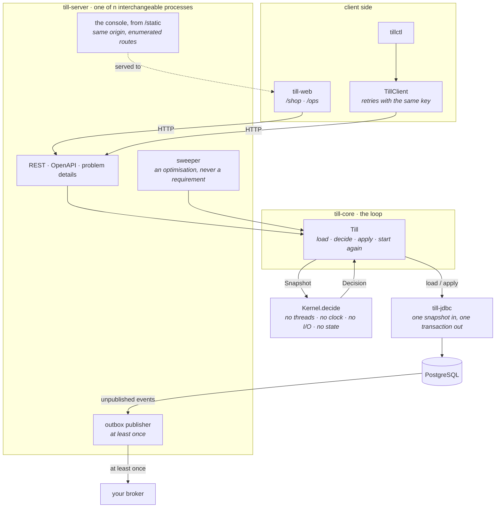
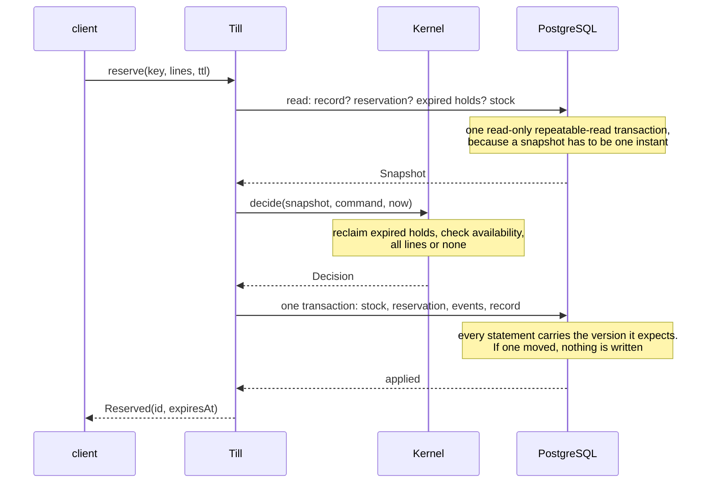

<h1 align="center">till</h1>

<p align="center">
  An oversell-proof inventory reservation service.<br>
  The rules as a pure function, a deterministic concurrency simulator, a PostgreSQL adapter with a
  transactional outbox, and a browser console you can watch two tabs race in.
</p>

<p align="center">
  <a href="https://github.com/jason-te-sde/till/actions/workflows/ci.yml">
    
  </a>
  
  
  
  
  <a href="LICENSE"></a>
</p>

---

Almost every e-commerce backend writes the checkout path like this:

```sql
update stock set quantity = quantity - ? where sku = ? and quantity >= ?
```

It does not oversell, and it is still wrong. It has nowhere to put the fifteen minutes between "I
want this" and "I have paid for this", so either the stock goes when the customer clicks — and comes
back by hand if they do not pay — or it goes when they pay, and two customers can both reach that
point. Add a retried request on a flaky mobile network and one of them is charged once and shipped
twice.

till is that path done properly: a hold with a deadline, an idempotency key that means a retry is a
retry, an audit log that cannot disagree with the balance, and a test suite built to find the races
rather than to demonstrate the happy one.

Four things make it worth a read:

- **The rules are a pure function.** No Spring, no I/O, no threads, no clock — time arrives as an
  argument. A whole day of contention between eight callers, with crashes, lost answers and clock
  jumps, is a function of one integer seed, so a bug found at seed 1 is still there at seed 1
  tomorrow.
- **The suite is proven to notice.** Four mistakes a hand-written implementation plausibly makes are
  put back on purpose, and the tests assert which check catches each. The simulator found a real bug
  on the first run it ever did.
- **There is something to look at.** A browser console ships inside the jar: a shop front where you
  can open two tabs and race yourself for the last unit, and an operator view of what the ledger
  holds. The end-to-end suite drives both, in a real browser, against the jar a release ships.
- **It runs, and it is meant to be run by somebody else.** Bearer tokens with a separate admin token,
  Prometheus metrics, OpenAPI, a container image CI builds and exercises, and an operations guide
  written for three in the morning.

## Try it

```bash
docker compose up -d --wait
open http://127.0.0.1:8080        # the shop; /ops for the ledger
```

The console asks for a bearer token — `demo-admin-token` in the compose file. Restock everything,
add a widget to the basket, and check out: the hold appears with a countdown, `available` drops and
`onHand` does not, and paying moves both. Then open the same page in a second tab, set a SKU to one
unit, and race yourself.

or without containers, against a PostgreSQL you already have:

```bash
mvn -Pweb package -DskipTests      # -Pweb builds the console into the jar
java -jar till-server/target/till-server-0.1.0.jar \
    --server.address=127.0.0.1 \
    --spring.datasource.url=jdbc:postgresql://localhost:5432/till
```

Then, with `tillctl` — this transcript is copied from a real run, not written by hand:

```console
$ tillctl adjust widget 100
widget                   onHand=100      reserved=0        available=100

$ tillctl reserve widget:2 --key=checkout-8123
cf1acbe9-547c-44fb-b091-446707131095  expires 2026-09-11T07:37:48.612585Z  widgetx2

$ tillctl stock widget
widget                   onHand=100      reserved=2        available=98     # on-hand has not moved

# the same key again, from a client that never saw the answer
$ tillctl reserve widget:2 --key=checkout-8123
cf1acbe9-547c-44fb-b091-446707131095  expires 2026-09-11T07:37:48.612585Z  widgetx2

$ tillctl stock widget
widget                   onHand=100      reserved=2        available=98     # two units held, not four

$ tillctl commit cf1acbe9-547c-44fb-b091-446707131095
committed cf1acbe9-547c-44fb-b091-446707131095 at 2026-09-11T07:23:33.035481Z

$ tillctl stock widget
widget                   onHand=98       reserved=0        available=98     # now it has

$ tillctl reserve widget:500
409 INSUFFICIENT_STOCK: not enough stock for widget (wanted 500, have 98)
  widget                   wanted 500, have 98

$ tillctl reserve widget:1 --ttl=1 --key=abandoned
75dc0fa9-9541-4b98-9939-845a4dd6aeab  expires 2026-09-11T07:23:35.597144Z  widgetx1

$ tillctl get 75dc0fa9-9541-4b98-9939-845a4dd6aeab
75dc0fa9-...  EXPIRED (stored HELD)  created ...  expires 2026-09-11T07:23:35.597144Z  widgetx1

$ tillctl commit 75dc0fa9-9541-4b98-9939-845a4dd6aeab
410 RESERVATION_EXPIRED: reservation 75dc0fa9-... expired at 2026-09-11T07:23:35.597144Z
```

That `EXPIRED (stored HELD)` is the design in one line. The row still says the hold is live because
no background job has been round yet, and it makes no difference: the deadline decides, so the answer
never depends on whether a sweeper happened to run. `scripts/demo.sh` walks through all of it.

Requires JDK 21+ and Maven 3.9+, or just Docker.

**Before putting it anywhere real:** the service refuses to listen on a non-loopback address without
a token, unless `--till.insecure=true` is passed. [`docs/operations.md`](docs/operations.md) covers
the settings, what to alert on, retention, sizing, backup, and a symptom-to-cause table.

## Use it as a library

The kernel has no Spring, no I/O, no threads and one dependency — `slf4j-api`, an API-only facade —
so it can be embedded in something that is not this service. That is the module most people would
want.

```xml
<dependency>
  <groupId>io.github.jason-te-sde</groupId>
  <artifactId>till-core</artifactId>
  <version>0.1.0</version>
</dependency>
```

```java
Till till = Till.on(new InMemoryLedger());          // or new JdbcLedger(dataSource)
till.adjust(IdempotencyKey.of("delivery-41"), Sku.of("widget"), 100);

Outcome outcome = till.reserve(
        IdempotencyKey.of("checkout-8123"),
        ReservationId.random(),
        List.of(Line.of("widget", 2)),
        Duration.ofMinutes(15));

switch (outcome) {
    case Outcome.Reserved held -> pay(held.id(), held.expiresAt());
    case Outcome.Rejected no   -> offerLess(no.shortfalls());
    default -> throw new IllegalStateException();
}
```

| Module | What it is for |
| --- | --- |
| `till-core` | the rules, the storage port, and an in-memory ledger |
| `till-jdbc` | PostgreSQL: optimistic concurrency and a transactional outbox |
| `till-testkit` | the simulator and the invariants, usable against a `Ledger` of your own |
| `till-client` | an HTTP client and `tillctl`, with no serialisation dependency |
| `till-server` | the whole service, if you want it rather than the pieces |
| `till-web` | the browser console, bundled into the server jar by `-Pweb` |

**Not on Maven Central yet.** The build signs and uploads from CI, but the account and the signing
key behind it cannot live in the repository; [`SETUP-PUBLISHING.md`](SETUP-PUBLISHING.md) is what a
maintainer follows to supply them and [`RELEASING.md`](RELEASING.md) is the release sequence. Until
then `mvn install` puts the modules in your local repository, and each release has the runnable jars
attached.

## Architecture



The load-bearing rule is one sentence: **the rules are a function, and the adapter writes all of its
output or none of it.** Everything else follows from those two.

`Decision` is the seam. The kernel returns a batch — one outcome for the caller, the row changes that
make it true, the events that describe them, and the idempotency record — and a `Ledger` applies the
whole batch in one transaction. Splitting that transaction is the failure the type exists to make
hard to express: a stock level lowered without its reservation moving to `COMMITTED` is stock that has
left the building and is still promised to somebody.

<details>
<summary><b>The path of a reservation</b></summary>



If the apply is refused, `Till` loads again and decides again. There is no sleep between attempts: a
conflict means somebody else's transaction committed, which means progress was made by somebody.
</details>

<details>
<summary><b>Why a retry is safe</b></summary>

Two copies of one request arrive at two servers at the same instant. Both load a snapshot with no
idempotency record, both decide to act, and both try to insert it. One transaction wins. The other is
refused by the primary key, returns "conflict", reloads, finds the record, and replays it. No lock,
and no window in which both succeed.

Two details are where this usually goes wrong, and both are tested:

1. **A reserve's fingerprint excludes the reservation id.** The server mints one per HTTP request, as
   a stateless server must, so including it would give every retry a different fingerprint and every
   retry would be rejected as a key reuse.
2. **Lines are canonicalised first** — sorted by SKU, duplicates refused — so a body listing the same
   SKUs in a different order is the same request.

A key reused for a genuinely *different* request is refused rather than served, because the two
cannot both be the one the key names. That is the one rejection never recorded under its own key:
recording it would make the mistake permanent.

And rejections *are* recorded. A retry of a request refused for want of stock is told the same "no" —
because the alternative is a client that retried a timeout being told "out of stock" and then
"created", having been charged for one order and shipped two.
</details>

## What is implemented

| | Notes |
| --- | --- |
| Holds with a deadline | all-or-nothing across SKUs, with every shortfall reported rather than the first |
| Commit, release, expire | committing lowers on-hand and reserved; releasing and expiring lower only reserved |
| Deadlines over stored state | a hold past its deadline is expired whether or not anything wrote that down, so the sweeper is an optimisation and never a requirement |
| Reclaim on demand | every command writes off the expired holds standing in its way, scoped to the SKUs it is about |
| Idempotency | keyed by the caller, with a fingerprint that ignores the server-minted id and the line order |
| Optimistic concurrency | a version per row, no locks, no backoff, bounded attempts |
| Transactional outbox | events in the same transaction as the change, delivered at least once, with stable deduplication keys |
| Oversell impossible at the database | `check (reserved >= 0 and on_hand >= 0 and reserved <= on_hand)` |
| Two bearer tokens | separate, because ejecting stock is not the same privilege as holding it |
| Secure by default | refuses to listen on a non-loopback address with no token, unless `--till.insecure` |
| Prometheus, OpenAPI, probes | metrics tagged by outcome rather than by status code; readiness and liveness answer different questions; latency published as a histogram so a quantile across instances is a real one |
| Retention that runs itself | three growing tables pruned on a schedule, in bounded batches, with the dangerous window defaulted long and the safe ones defaulted to *keep forever* |
| A request id on everything | `X-Request-Id` in, out, in every log line, and in the body of every error — so a screenshot of a failure is enough to find the logs |
| Errors described in the contract | every non-2xx response declares an RFC 9457 `Problem`, and a test checks the declaration against a real refusal taken off the wire |
| Container image | a multi-stage build with the console inside it, and a CI job that brings the stack up and drives a hold through it |
| A browser console | `/shop` to see why reservations exist, `/ops` to see what the ledger holds. Served from inside the jar, same origin, with the SPA routes enumerated rather than caught all |
| A typed contract | the console's TypeScript is generated from a committed `openapi.json`, which a server test regenerates and fails on when it goes stale |

Not implemented, on purpose: a product catalogue, multi-tenancy, partial fulfilment, backorders,
reserving a specific unit, scheduled availability, read replicas, rate limiting, and any database but
PostgreSQL. [`docs/design/0005-scope.md`](docs/design/0005-scope.md) gives the reasoning for each and
[`SECURITY.md`](SECURITY.md) states what the project does and does not defend against.

## Numbers

Measured on an Apple M-series laptop, PostgreSQL 17, JDK 21 and 25. Every figure has the command that
produced it.

| | |
| --- | --- |
| Tests | **393** — 296 Java, 86 console, 11 end-to-end (plus one soak, off by default) |
| Coverage | **88.1% / 81.0%** lines / branches on the Java, **87.1% / 83.6%** on the console |
| `mvn verify`, whole reactor | **21s** |
| Simulation throughput | **79,416 steps/s** |
| Soak | 10,000 seeds, **30,216,914 invariant checks**, 4,812,844 conflicts, 4,301,575 answers, **381s**, zero violations |
| Real threads, real PostgreSQL | 200 callers, 20 units, **exactly 20 sales** |
| Two browser tabs, one unit | **exactly one gets it**, the other is told by how much it fell short |
| Service start to ready | **2.0s** |
| Console bundle | 289 kB, **89 kB gzipped** |
| Hand-written Java | 9,265 lines main, 5,603 lines test |
| Hand-written TypeScript | 1,910 lines source, 1,890 lines test, 140 lines CSS |
| SQL | 103 lines across two migrations |
| Runtime dependencies | `till-core`: **one**, `slf4j-api`. `till-web`: **three**, React, its DOM renderer, a router |

```bash
mvn verify -Dcoverage                                       # Java tests and coverage
cd till-web && npm run check && npm run test:coverage       # the console
mvn test -pl till-testkit -Dtill.sim.seeds=10000 \
    -Dtest=SoakTest -Dsurefire.failIfNoSpecifiedTests=false  # soak
```

The soak number is the one worth reading. Thirty million invariant checks in six minutes is possible
only because the rules never touch a database, and that is the whole argument for writing them as a
function: the same coverage through a transaction would take about a month.

The 4.8 million conflicts matter as much. A simulation of contending callers that produced *no*
conflicts would have tested the happy path four million times, and would go on passing after the
concurrency control was deleted. Every chaos test here asserts the run was hostile — conflicts,
replays, injected crashes, lost answers, expiries and refusals all have to have happened.

There is no throughput figure for the service, on purpose. Measuring it on one laptop against one
PostgreSQL would say more about the laptop than about till.

**What has been run.** Every number above is measured, and every path in this README has now been
executed: the service against a real PostgreSQL, driven by `tillctl`, by the Java client and by a
real browser against the jar with the console bundled into it; the full `docker compose` stack, which
is where the last two bugs below came from; and all eight CI jobs on GitHub's runners, across two
JDKs and two Node versions.

## How it is tested

Seven layers, each covering what the cheaper one below it cannot:

| Layer | Covers |
| --- | --- |
| **Unit** | one rule, one state transition, one boundary |
| **Deterministic simulation** | interleavings, crashes, lost answers, clock jumps — every invariant after every step |
| **Differential** | the same seeded schedule against both ledgers, compared row for row |
| **Real concurrency** | that PostgreSQL's conditional update and unique constraint do what the design assumes |
| **Integration** | the wiring: Flyway, Spring's binding, filter order, an `Instant` surviving Jackson and `timestamptz` |
| **Console unit** | the checkout state machine — which requests share an idempotency key and which do not |
| **End to end** | a real browser against the jar that ships, including two tabs racing for the last unit |

A command is not one operation in the simulator. It is three phases — load, decide, apply — and one
phase of one caller runs per step. That is what makes the races real: between one caller loading and
the same caller applying, any number of others can have decided and applied against rows it now holds
a stale view of.

The invariant that pulls the most weight is not the obvious one. "Never oversold" is
`reserved <= onHand`, and it is checked. The one that finds bugs is **the ledger agrees with its own
audit log**: on-hand must equal the adjustments in the outbox minus the commits, and reserved must
equal the reservations minus the commits, releases and expiries. That catches a change written
without its event and an event written for a change that did not happen — the two failure modes a
transactional outbox exists to prevent, and the two that otherwise surface months later as a
downstream system that has quietly drifted.

`History` covers what invariants structurally cannot. They ask whether the ledger is consistent with
itself, and a ledger can be flawlessly consistent while telling a caller its hold was created when
nothing was written. So every answer given during a run is kept and checked against the final state:
one key gives one answer, a promised hold exists with the lines and the deadline promised, and every
committed reservation was announced to somebody.

The console's suite is about the same property as the kernel's, one layer out. `useCheckout` holds
one attempt key per attempt and derives a key per step from it, and the tests assert the
consequences: clicking Pay twice sends one key; retrying a refused basket sends the same key;
starting a second attempt sends a new one. Each of those decides whether somebody is charged once or
twice, and none is visible in a screenshot — so the HTTP layer is mocked at the network rather than
by stubbing `fetch`, and the assertions are on what went over the wire.

The end-to-end suite runs a real browser against the jar with the console inside it, which is the
artifact a release ships. Its centrepiece is two browser contexts — two session stores, two cookie
jars — both adding the last unit to a basket and both checking out. One gets a hold with a countdown;
the other is told it wanted one and none is left.

### Proof that the suite would notice

A green run says something about the code only if the tests can go red.

| Flaw put back on purpose | What it is | Caught by |
| --- | --- | --- |
| `LOST_UPDATE` | expected versions not checked, so the later of two decisions wins | the ledger agrees with its own audit log |
| `NO_IDEMPOTENCY` | a recorded outcome is never returned, so a retry runs twice | deduplication keys are unique |
| `PARTIAL_APPLY` | mutations written, the events beside them dropped | the ledger agrees with its own audit log |
| `RESERVED_IGNORED` | availability read as `stock >= quantity`, which is how every tutorial writes it | the kernel refusing to build an impossible value |

Each is caught within a few thousand steps, on all twenty seeds the test sweeps rather than on one
lucky one. Two plausible mistakes are deliberately **not** on the list because the design makes them
harmless: applying a decision twice (mutations carry absolute values, not deltas) and a ledger that
offers a live hold as reclaimable (the kernel re-checks the deadline; it does not trust the adapter).

### Bugs found before the first release

<table>
<tr><th>Bug</th><th>What caught it</th></tr>
<tr>
<td><b>Pruning old idempotency records could wedge a command permanently.</b> An adjustment has no
identity of its own, so its event borrows the command's idempotency key:
<code>adjusted:&lt;key&gt;</code>. That name is unique only for as long as the ledger remembers the
key. Forget the record while the event is still in the outbox and the next execution of that command
writes an event whose deduplication key already exists — the insert conflicts, the decision can never
be applied, and the caller is told <b>503, for good</b>. A command that had worked an hour earlier
becomes impossible.</td>
<td>Writing the retention test, which is exactly what it looked like from the outside: a 503 with no
contention behind it. The delete now refuses while the event is present, the sweep does the outbox
first so one pass can still do both, and the resulting coupling — for adjustments the effective
window is the larger of the two — is written down rather than left to be rediscovered.</td>
</tr>
<tr>
<td><b>The published contract described every failure with the schema of the success.</b> springdoc
gives a declared response the return type of the method unless told otherwise, so
<code>POST /v1/reservations</code> published 404, 409, 422 <i>and</i> 503 as all returning a
<code>Reserved</code>. Not merely undocumented: actively wrong, and the generated TypeScript said so
too, so a client written against the contract would have destructured <code>id</code> off a problem
body.</td>
<td>Reading the generated types during a self-audit. There is now a <code>Problem</code> schema, one
customizer pointing every non-2xx at it, and a test that takes a <i>real</i> refusal off the wire and
asserts the contract declares every field in it — because a hand-written schema beside a
hand-assembled body is two declarations of one shape, and two declarations drift.</td>
</tr>
<tr>
<td><b>The console invented an error code the service never sent.</b> The shop front turned a 403
into an error carrying <code>code: 'FORBIDDEN'</code> so its notice component had something to match
on. The authentication filter's problem body carried no <code>code</code> at all — it writes its JSON
by hand, because it runs before Spring MVC exists — so the value existed only inside the browser.</td>
<td>Typing that field from the generated contract, which turned the invented value into a compile
error. The filter now sends <code>UNAUTHORIZED</code> or <code>FORBIDDEN</code>, which is a
distinction worth having anyway: by status alone a caller cannot tell "sign in" from "ask somebody
for a better token", and those call for opposite things.</td>
</tr>
<tr>
<td><b>The most important metric in the operations guide could not fire for the failure it was
written for.</b> <code>till_outbox_backlog</code> was a number the publisher pushed after each run.
So it was accurate exactly while the publisher was working, and frozen — or, with the publisher
disabled, absent — when it was not. A stalled publisher and an empty outbox reported the same
thing.</td>
<td>Rereading the alerting table and asking what each metric does when the component it describes is
the broken one. It is now a gauge read through to the table on scrape: one indexed
<code>count(*)</code>, correct whether the publisher is running, disabled, or dead.</td>
</tr>
<tr>
<td><b>Both administrative listings were sequential scans.</b> <code>order by sku collate "C"</code>
cannot use the primary key's index, because that index is built with the database's collation and the
query asks for another one — and the explicit collation is not optional, it is what makes the two
ledgers order rows identically. The reservation listing filtered on <code>state</code> using an index
that does not contain it, so filtering to a rare state read the whole index and threw most of it
away — and the rarest state is the one an operator clicks.</td>
<td><code>explain (analyze)</code> against 200,000 rows, during the same audit. Before: 100,000 rows
sorted to return 100. After: 100 rows read. The plans are in the migration, beside the indexes.</td>
</tr>
<tr>
<td><b>One timestamp came from a different clock than every other.</b> <code>markPublished</code>
stamped <code>published_at</code> with SQL <code>now()</code> while everything else in the system
takes the instant from an injected <code>Clock</code>. Harmless until retention had to compare the
two, at which point "delete rows published more than thirty days ago" was a comparison across two
clocks that nobody can reason about — or write a test for.</td>
<td>A retention test that moved its clock thirty-one days forward and found nothing had been pruned.
The instant is now passed in, like every other one.</td>
</tr>
<tr>
<td><b>Committing a hold that had already been written off gave its stock back a second time.</b>
<code>effectiveState</code> collapses two different situations into one answer — a hold still stored
as <code>HELD</code> whose deadline has passed, and one written off an hour ago — and the commit path
acted on the answer rather than on the stored state. Only the first still has stock to return; the
second took <code>reserved</code> to −4.</td>
<td>The simulator, at <b>seed 1, step 66, on the first run it ever did</b>. The hand-written tests
covered only the stored-<code>HELD</code> case, so they structurally could not reach it.</td>
</tr>
<tr>
<td><b>The service's migrations never ran, and the integration suite passed anyway.</b> Spring Boot 4
moved Flyway's auto-configuration into a module of its own, so <code>flyway-core</code> on the
classpath stopped being enough — and nothing said so. The suite kept passing because <i>another
module's test fixture</i> had created identically named tables in the same database, so the service
found the schema it needed and never noticed it had not built it.</td>
<td>Giving each module a database of its own, which removed the thing that had been covering for it.
Two mistakes hiding each other. <code>MigrationTest</code> now asserts the schema history says what
this build ships.</td>
</tr>
<tr>
<td><b>The service could not start at all.</b>
<code>@ConditionalOnMissingBean</code> on a <code>@Component</code> is only defined to work on a
<code>@Bean</code> method inside an auto-configuration; on a component it is evaluated against
whatever has been scanned so far. Used that way it produced no event publisher, and the outbox
publisher had nothing to inject.</td>
<td>Starting the service. The integration suite <i>structurally could not</i> see it: those tests
supply a publisher of their own so they can read what it was handed, and in doing so they satisfy the
very dependency whose absence stopped the service.
<code>DefaultPublisherTest</code> runs the production wiring.</td>
</tr>
<tr>
<td><b>PostgreSQL and Java disagreed about string order.</b> A database created with
<code>en_US.UTF-8</code> does not sort punctuation the way <code>String.compareTo</code> does, so the
two ledgers offered expired holds to the kernel in different orders and reclaimed different ones.</td>
<td>The differential test, which compares the two ledgers row for row. Every <code>order by</code> in
the adapter is now <code>collate "C"</code>.</td>
</tr>
<tr>
<td><b>The schema loader cut a comment in half.</b> It split the file on <code>;</code> and then
stripped comments — and one comment contained a semicolon, so the prose after it was glued to the
front of the next statement.</td>
<td>The adapter suite, the first time it ran against a real database. Now comments are stripped
first, and a test asserts every statement starts with <code>create</code>.</td>
</tr>
<tr>
<td><b>A test fixture hid its own failure.</b> It assigned the shared <code>DataSource</code> field
<i>before</i> creating the schema, so the creation failure was reported once and then every later
call found a non-null field and returned a pool pointing at half a schema.</td>
<td>Chasing the bug above, which is why that one presented as "relation does not exist" fifteen tests
later instead of as a syntax error in one.</td>
</tr>
<tr>
<td><b><code>-parameters</code> was missing from the build,</b> so Spring MVC could not bind a
<code>@PathVariable</code> without each name repeated as a string, and every path-variable endpoint
answered 400 at runtime telling you to set the flag. Spring Boot's own parent POM sets it; this build
does not use that parent.</td>
<td>The integration suite, on its first green context.</td>
</tr>
<tr>
<td><b>A deprecated status constant.</b> <code>HttpStatus.UNPROCESSABLE_ENTITY</code> is deprecated in
Spring 7, RFC 9110 having renamed 422. Trivial, and listed because of how it was found: the build
compiles with <code>-Werror</code>, so a deprecation warning is a build failure.</td>
<td><code>-Werror</code>.</td>
</tr>
<tr>
<td><b>The console took a hold while rendering.</b> The checkout screen reserved stock from a mount
effect. React's own lint rule objected, and the rule was right for a bigger reason than the one it
gives: reserving is a mutation, a component that mutates while rendering does it again on every
re-mount, and in development React mounts everything twice. The idempotency key was covering for it —
which is exactly why relying on that would have been the wrong reason not to fix it. The whole flow
moved into a hook driven by the click.</td>
<td><code>react-hooks/set-state-in-effect</code>, and then thinking about why it was complaining.</td>
</tr>
<tr>
<td><b>The published OpenAPI document described a URL nobody could use.</b> springdoc derives an
absolute <code>servers</code> entry from whichever request it happened to answer — behind a proxy
that is the proxy's view of itself, and in a test it is a random port.</td>
<td><code>OpenApiContractTest</code>, which could never have passed while it was there. The document
now declares a relative URL explicitly, which is both stable and correct in production.</td>
</tr>
<tr>
<td><b>The published contract said every response field was optional.</b> springdoc infers nothing
about nullability from a record component, not even a primitive one, so a generated client typed
every field as possibly-undefined and every call site would have grown a check for a case that
cannot happen.</td>
<td>Generating the TypeScript and reading it. Response fields now say they are required.</td>
</tr>
<tr>
<td><b>A filter button appeared to do nothing for two seconds.</b> The polling hook re-read on its
interval and nowhere else, so changing the query waited out the tick — long enough for somebody to
click it twice.</td>
<td>An operator-console test that clicked a filter and asserted the service was asked. It now reads
again the moment the question changes.</td>
</tr>
<tr>
<td><b>A concurrency test asserted something a concurrency test cannot promise.</b> "A hundred
threads on one row that never conflicted did not exercise the retry loop" — except that ninety of
those hundred are refused for want of stock, and a refusal writes no stock row and so has no version
to conflict on. The contending writers were only the ten that succeeded, and on a loaded machine ten
can be serialised. It failed twice in a full build and never once in twenty isolated runs.</td>
<td>Chasing an intermittent red build. The fix was <i>not</i> to relax the assertion: it moved to
where it is deterministic — one test constructs the conflict by hand, and the simulator requires
thousands of them from a seed — and the threaded test kept the job only it can do, which is checking
that the ledger's locking publishes what it wrote. A starting-gun latch went in alongside, so the
threads that are supposed to overlap actually do.</td>
</tr>
<tr>
<td><b>The end-to-end suite depended on the residue of the previous run.</b> Holds left by an earlier
run expired part-way through a later one and handed their units back, changing an availability count
underneath an assertion that was correct when it was written.</td>
<td>Running it twice. The fixture now releases every open hold before seeding, so each test starts
from a state it chose.</td>
</tr>
<tr>
<td><b>Vite's preview server binds to <code>::1</code> only,</b> so a health check or a CI URL
written against <code>127.0.0.1</code> cannot reach it. And Playwright's <code>hasText</code> is a
case-insensitive substring match, so a locator for the "Widget" card also matched the "Gadget" card,
whose description mentions a widget. And springdoc's generated operation ids were the Java method
names, so two controllers with a <code>list</code> method produced <code>list</code> and
<code>list_2</code> in every generated client.</td>
<td>Three small ones, grouped because each is a twenty-minute confusion the first time and never
again. All three are now explicit in configuration rather than inherited from a default.</td>
</tr>
<tr>
<td><b>Two major versions of Testcontainers were on the test classpath at once.</b> The parent
imported Spring Boot's BOM and then a Testcontainers BOM after it. The first import of a managed
version wins, so Boot's 2.0.5 took <code>org.testcontainers:testcontainers</code> while the later
import supplied <code>postgresql</code>, <code>jdbc</code> and <code>junit-jupiter</code> at 1.21.4 —
1.x modules against a 2.x core. It worked, for as long as the API surface happened to overlap.
<code>requireUpperBoundDeps</code> cannot see it: they are different artifacts, not two versions of
one.</td>
<td>Reading a Dependabot pull request instead of merging it. The second BOM is gone — Boot already
pins Testcontainers and is built against what it pins — and the modules moved to their 2.x names and
packages. Found only because the bump was inspected; a green tick on that pull request would have
hidden the mix rather than revealed it.</td>
</tr>
<tr>
<td><b>The container image could not be built at all.</b> The runtime stage created its service user
at uid and gid 1000, which <code>eclipse-temurin:21-jre</code> already has, so
<code>groupadd</code> exited 4 and the build stopped. A hard-coded low id is a collision waiting for
whichever base image picks it next.</td>
<td>The first CI run after the repository was pushed — the one job in this project that had never
been executed, failing on the first thing it did. The id is now 10001: still pinned, because a
Kubernetes <code>runAsUser</code> has to name a number, and out of the way of anything a distribution
assigns.</td>
</tr>
<tr>
<td><b>Every command line invocation printed a line about a JVM flag.</b>
<code>JAVA_TOOL_OPTIONS</code> in the image applies to every JVM it starts, and the JVM announces it
on stderr — so <code>tillctl stock widget</code> greeted its answer with
<code>Picked up JAVA_TOOL_OPTIONS</code> every time.</td>
<td>Running the compose stack and reading the output. The flag moved onto the server's entrypoint,
which is the only process it was ever about.</td>
</tr>
<tr>
<td><b>Two of my own assertions were wrong, not the code.</b> A stale-version test asserted one outbox
row where the setup legitimately produced two adjustments; a client test expected an I/O failure
where reporting the service's own 503 is strictly more useful; a console-route test asserted a 404
that becomes a 200 the moment somebody builds with <code>-Pweb</code>.</td>
<td>Reading the failure instead of the assertion. Listed because "the test was wrong" is the most
common outcome of a failing test, and a bug list that omits it is a bug list that has been curated.</td>
</tr>
</table>

[`docs/testing.md`](docs/testing.md) also lists what the suite does **not** cover — no torn writes, no
real process kill, no clock skew between instances, no fuzzing at the HTTP layer, no load test —
because a testing document that only lists strengths is marketing.

## Reading the code

Ten minutes, in this order:

| File | Why |
| --- | --- |
| [`core/Kernel.java`](till-core/src/main/java/io/till/core/Kernel.java) | the rules, as one pure function |
| [`core/Decision.java`](till-core/src/main/java/io/till/core/Decision.java) | the contract that makes "all of it or none of it" structural |
| [`core/Till.java`](till-core/src/main/java/io/till/core/Till.java) | the four-line loop, and why there is no backoff in it |
| [`testkit/Invariants.java`](till-testkit/src/main/java/io/till/testkit/Invariants.java) | the properties, and what each one catches |
| [`testkit/Sim.java`](till-testkit/src/main/java/io/till/testkit/Sim.java) | why a command is three phases rather than one |
| [`jdbc/JdbcLedger.java`](till-jdbc/src/main/java/io/till/jdbc/JdbcLedger.java) | two transactions per attempt, and why they differ |
| [`web/shop/useCheckout.ts`](till-web/src/shop/useCheckout.ts) | one key per attempt, one per step, and why the reserve is not in an effect |
| [`web/api/idempotency.ts`](till-web/src/api/idempotency.ts) | the smallest file here, and the one that decides whether somebody is charged twice |

| Document | |
| --- | --- |
| [`docs/architecture.md`](docs/architecture.md) | the layering, the seam, and where the transaction boundary is |
| [`docs/testing.md`](docs/testing.md) | what each layer proves, and the known gaps |
| [`docs/operations.md`](docs/operations.md) | running it: tuning, alerting, retention, sizing, backup, upgrades |
| [`docs/design/`](docs/design/) | one note per decision, each with its costs and rejected alternatives |

## Layout

```
till-core       the rules: a pure function, the storage port, an in-memory ledger
till-jdbc       PostgreSQL: optimistic concurrency, a transactional outbox, the schema
till-testkit    a deterministic simulator, the invariants, and the flaws it is proven to catch
till-client     an HTTP client and tillctl, with no serialisation dependency
till-server     REST, OpenAPI, metrics, the sweeper, the outbox publisher
till-web        the browser console: a shop front and an operator view, bundled by -Pweb
```

## License

MIT
