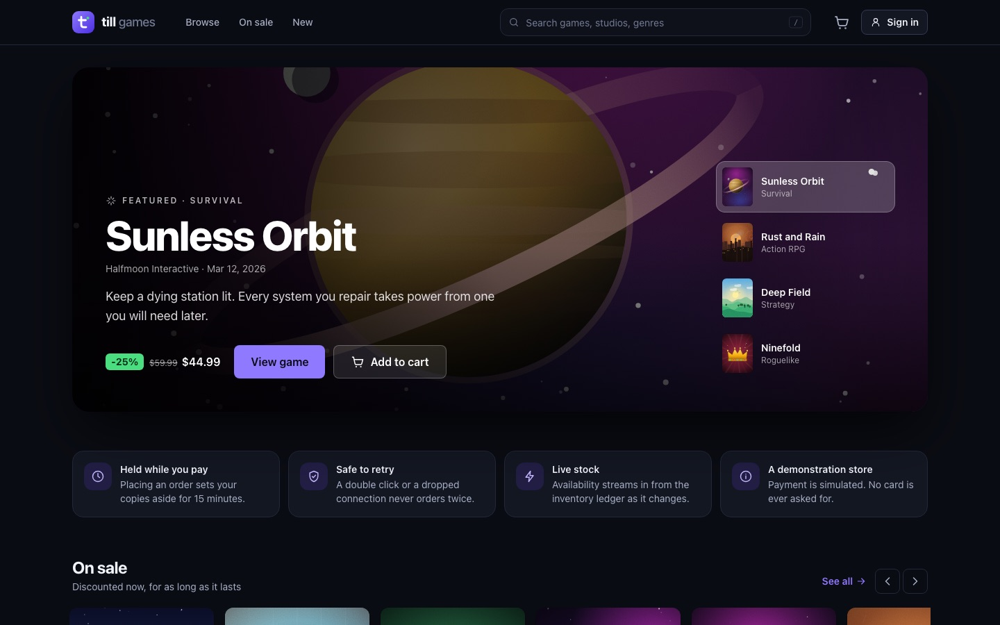
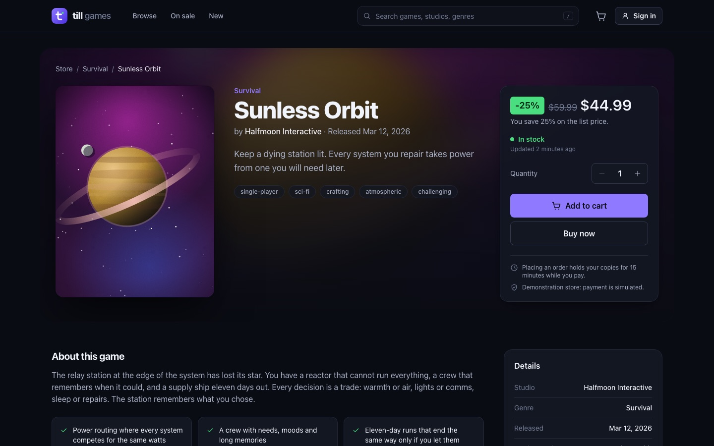
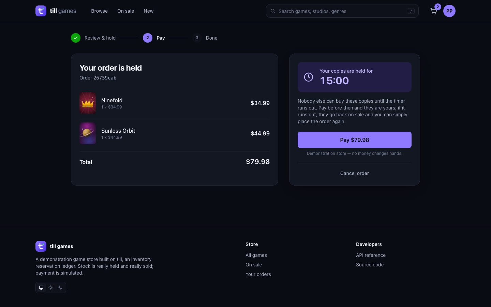
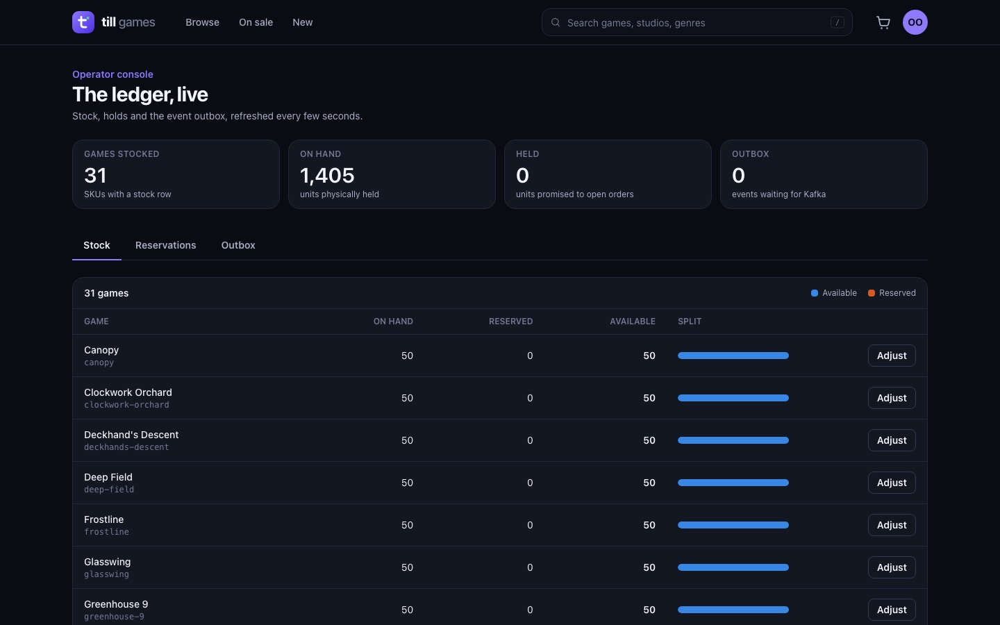
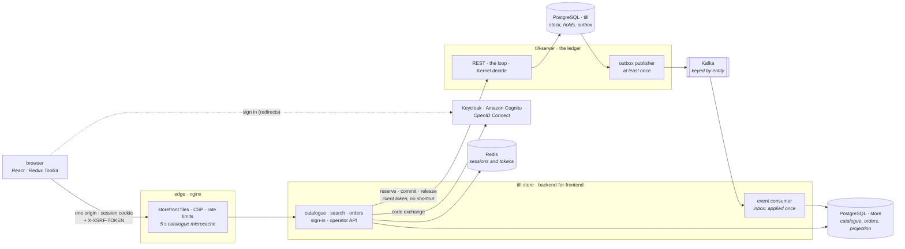
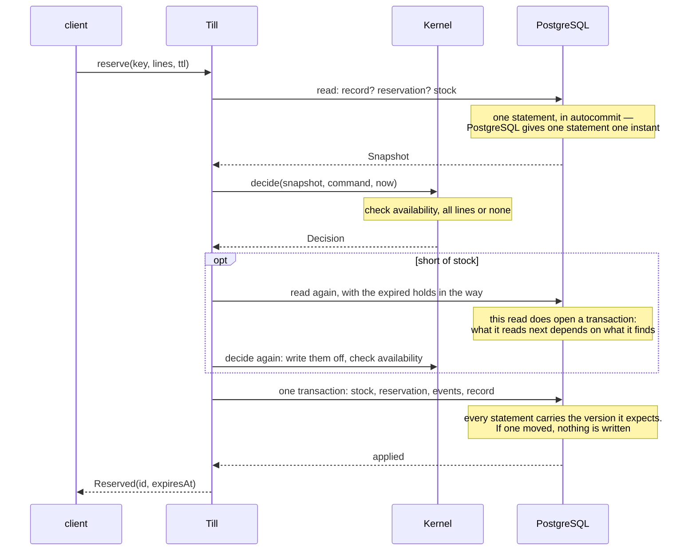

<h1 align="center">till</h1>

<p align="center">
  A game store that cannot oversell.<br>
  A React storefront and operator console on a Spring Boot backend-for-frontend with OpenID Connect
  sign-in — and, deciding every sale, a reservation ledger whose rules are a pure function, tested by a
  deterministic concurrency simulator, with a transactional outbox to Kafka and an idempotent consumer
  on the other end.
</p>

<p align="center">
  <a href="https://github.com/jason-te-sde/till/actions/workflows/ci.yml">
    
  </a>
  
  
  
  
  <a href="LICENSE"></a>
</p>

<p align="center">
  
</p>

---

till is a complete store you can run with one command, built the way a store that takes real money
would have to be:

- **A customer** browses thirty-two games with full-text search, facets and sorting; signs in through
  an identity provider; places an order that holds the copies for fifteen minutes behind a live
  countdown; pays; and finds it in their order history. Payment is simulated. Nothing else is.
- **An operator** — a member of the identity provider's `admins` group — watches the ledger live: the
  stock, the holds against it (including the ones past their deadline that nothing has written off
  yet), and the event outbox, and restocks a game with a click. The storefront hears about it through
  Kafka within seconds.
- **Underneath, one service decides every sale.** The store asks it for a hold with an ordinary client
  token and cannot move stock any other way — so a bug anywhere in the storefront can cost a customer
  a refused checkout, and cannot oversell.

<table>
<tr>
<td width="33%"></td>
<td width="33%"></td>
<td width="33%"></td>
</tr>
<tr>
<td align="center">A game's page, with stock streamed from the ledger</td>
<td align="center">Checkout: the copies are held while you pay</td>
<td align="center">The operator console: the ledger, live</td>
</tr>
</table>

## Why a ledger

Almost every e-commerce backend writes the checkout path like this:

```sql
update stock set quantity = quantity - ? where sku = ? and quantity >= ?
```

It does not oversell, and it is still wrong. It has nowhere to put the fifteen minutes between "I
want this" and "I have paid for this", so either the stock goes when the customer clicks — and comes
back by hand if they do not pay — or it goes when they pay, and two customers can both reach that
point. Add a retried request on a flaky mobile network and one of them is charged once and shipped
twice.

till is that path done properly — a hold with a deadline, an idempotency key that means a retry is a
retry, an audit log that cannot disagree with the balance — with a store built on top of it the way
it would be in production. Five things make it worth a read:

- **The rules are a pure function.** No Spring, no I/O, no threads, no clock — time arrives as an
  argument. A whole day of contention between eight callers, with crashes, lost answers and clock
  jumps, is a function of one integer seed, so a bug found at seed 1 is still there at seed 1
  tomorrow.
- **The suite is proven to notice.** Four mistakes a hand-written implementation plausibly makes are
  put back on purpose, and the tests assert which check catches each. The simulator found a real bug
  on the first run it ever did.
- **The browser never holds a token.** Signing in is the authorization-code flow with PKCE, run on the
  server; the tokens stay in a Redis session, and the browser holds a cookie no script can read. The
  whole round trip — PKCE, nonce, forged tokens, login CSRF, session fixation — is tested against an
  in-process identity provider, and again in a browser against Keycloak.
- **A retry is safe from the button to the database.** One idempotency key per checkout attempt and
  cart, one per payment; namespaced per customer before it reaches the ledger's global key space;
  replayed by the ledger; and absorbed by an inbox where the events land. Every one of those is
  asserted on the wire.
- **It runs, and it is meant to be run by somebody else.** One `docker compose up` for the whole
  platform, with health checks; an edge proxy with a Content-Security-Policy, rate limits and a
  microcache; OpenAPI contracts checked against real failures; Prometheus; CI that builds every image
  and drives the store in a browser; and an operations guide written for three in the morning.

## Try it

```bash
docker compose up -d --wait
open http://localhost:8080
```

| Account | Password | What it can do |
| --- | --- | --- |
| `player` | `player` | shop: browse, check out, see its orders |
| `operator` | `operator` | the same, and the operator console at `/ops` |

Demonstration accounts, from [`docker/keycloak/till-realm.json`](docker/keycloak/till-realm.json).
New accounts can be registered from the sign-in page; Keycloak's own console is at
`http://localhost:8180` (`admin` / `admin`).

A tour:

1. **Add a game or two and check out.** You are sent to sign in and brought straight back to checkout,
   with the cart intact — it lives in the browser, not the session.
2. **Place the order.** The copies are held, and the countdown is the ledger's deadline. The game's
   availability drops for everybody else.
3. **Pay**, and the order is in your history. Or let the timer run out, and the copies go back on sale.
4. **Sign in as `operator` in a private window, open `/ops` and restock a game.** Its page catches up
   within seconds: ledger → outbox → Kafka → the store's projection.

The ledger also stands on its own, with its own CLI — this transcript is copied from a real run, not
written by hand:

```console
$ tillctl adjust widget 100
widget                   onHand=100      reserved=0        available=100

$ tillctl reserve widget:2 --key=checkout-8123
cf1acbe9-547c-44fb-b091-446707131095  expires 2026-09-11T07:37:48.612585Z  widgetx2

$ tillctl stock widget
widget                   onHand=100      reserved=2        available=98     # on-hand has not moved

# the same key again, from a client that never saw the answer
$ tillctl reserve widget:2 --key=checkout-8123
cf1acbe9-547c-44fb-b091-446707131095  expires 2026-09-11T07:37:48.612585Z  widgetx2

$ tillctl stock widget
widget                   onHand=100      reserved=2        available=98     # two units held, not four

$ tillctl commit cf1acbe9-547c-44fb-b091-446707131095
committed cf1acbe9-547c-44fb-b091-446707131095 at 2026-09-11T07:23:33.035481Z

$ tillctl stock widget
widget                   onHand=98       reserved=0        available=98     # now it has

$ tillctl reserve widget:500
409 INSUFFICIENT_STOCK: not enough stock for widget (wanted 500, have 98)
  widget                   wanted 500, have 98

$ tillctl reserve widget:1 --ttl=1 --key=abandoned
75dc0fa9-9541-4b98-9939-845a4dd6aeab  expires 2026-09-11T07:23:35.597144Z  widgetx1

$ tillctl get 75dc0fa9-9541-4b98-9939-845a4dd6aeab
75dc0fa9-...  EXPIRED (stored HELD)  created ...  expires 2026-09-11T07:23:35.597144Z  widgetx1

$ tillctl commit 75dc0fa9-9541-4b98-9939-845a4dd6aeab
410 RESERVATION_EXPIRED: reservation 75dc0fa9-... expired at 2026-09-11T07:23:35.597144Z
```

That `EXPIRED (stored HELD)` is the design in one line. The row still says the hold is live because
no background job has been round yet, and it makes no difference: the deadline decides, so the answer
never depends on whether a sweeper happened to run. `scripts/demo.sh` walks through all of it.

`docker compose run --rm tillctl <command>` runs it against the stack's ledger. Without containers, the
ledger needs only a PostgreSQL you already have:

```bash
mvn package -DskipTests
java -jar till-server/target/till-server-0.1.0.jar \
    --server.address=127.0.0.1 \
    --spring.datasource.url=jdbc:postgresql://localhost:5432/till
```

Docker runs the whole platform. Building needs JDK 21+ and Maven 3.9+, and Node 24+ only to work on
the storefront — [`CONTRIBUTING.md`](CONTRIBUTING.md) has the development loop.

**Before putting it anywhere real:** the ledger refuses to listen on a non-loopback address without a
token, unless `--till.insecure=true` is passed, and the store refuses to start without an identity
provider. [`docs/operations.md`](docs/operations.md) covers the settings — Cognito included — what to
alert on, retention, sizing, backup, and a symptom-to-cause table.

## Use it as a library

The kernel has no Spring, no I/O, no threads and one dependency — `slf4j-api`, an API-only facade —
so it can be embedded in something that is not this service. That is the module most people would
want.

```xml
<dependency>
  <groupId>io.github.jason-te-sde</groupId>
  <artifactId>till-core</artifactId>
  <version>0.1.0</version>
</dependency>
```

```java
Till till = Till.on(new InMemoryLedger());          // or new JdbcLedger(dataSource)
till.adjust(IdempotencyKey.of("delivery-41"), Sku.of("widget"), 100);

Outcome outcome = till.reserve(
        IdempotencyKey.of("checkout-8123"),
        ReservationId.random(),
        List.of(Line.of("widget", 2)),
        Duration.ofMinutes(15));

switch (outcome) {
    case Outcome.Reserved held -> pay(held.id(), held.expiresAt());
    case Outcome.Rejected no   -> offerLess(no.shortfalls());
    default -> throw new IllegalStateException();
}
```

| Module | What it is for |
| --- | --- |
| `till-core` | the rules, the storage port, and an in-memory ledger |
| `till-jdbc` | PostgreSQL: optimistic concurrency and a transactional outbox |
| `till-testkit` | the simulator and the invariants, usable against a `Ledger` of your own |
| `till-client` | an HTTP client and `tillctl`, with no serialisation dependency |
| `till-kafka` | publishes the outbox to Kafka; no Spring, plain `kafka-clients` |
| `till-server` | the ledger as a service — the only thing that may decide a sale |
| `till-store` | the game store: catalogue, search, orders, sign-in — the backend the browser talks to |
| `till-web` | the storefront and operator console, served by the edge proxy |

**Not on Maven Central yet.** The build signs and uploads from CI, but the account and the signing
key behind it cannot live in the repository; [`SETUP-PUBLISHING.md`](SETUP-PUBLISHING.md) is what a
maintainer follows to supply them and [`RELEASING.md`](RELEASING.md) is the release sequence. Until
then `mvn install` puts the modules in your local repository, and each release has the runnable jars
attached.

## Architecture


```mermaid
flowchart LR
    B["browser<br/><i>React · Redux Toolkit</i>"]
    IDP["Keycloak · Amazon Cognito<br/><i>OpenID Connect</i>"]

    subgraph edge["edge · nginx"]
        E["storefront files · CSP · rate limits<br/><i>5 s catalogue microcache</i>"]
    end

    subgraph store["till-store · backend-for-frontend"]
        S["catalogue · search · orders<br/>sign-in · operator API"]
        C["event consumer<br/><i>inbox: applied once</i>"]
    end

    R[("Redis<br/><i>sessions and tokens</i>")]
    SDB[("PostgreSQL · store<br/><i>catalogue, orders, projection</i>")]

    subgraph ledger["till-server · the ledger"]
        L["REST · the loop · Kernel.decide"]
        P["outbox publisher<br/><i>at least once</i>"]
    end

    LDB[("PostgreSQL · till<br/><i>stock, holds, outbox</i>")]
    K[["Kafka<br/><i>keyed by entity</i>"]]

    B -- "one origin · session cookie<br/>+ X-XSRF-TOKEN" --> E
    B -. "sign in (redirects)" .-> IDP
    E --> S
    S -- "code exchange" --> IDP
    S --> R
    S --> SDB
    S -- "reserve · commit · release<br/><i>client token, no shortcut</i>" --> L
    L --> LDB
    LDB --> P
    P --> K
    K --> C
    C --> SDB
```

The load-bearing rule is one sentence: **the rules are a function, and the adapter writes all of its
output or none of it.** Everything else follows from those two.

**The browser talks to one origin.** The edge serves the storefront's files and proxies the rest to
the store — the API, the sign-in round trip, the API docs. The ledger is not reachable through it at
all, and nothing a browser can reach holds a ledger token.

**The store is a backend-for-frontend.** It owns everything a customer sees that is not a stock level
— the catalogue, search, orders, sign-in — and the operator console's API, which answers only the
identity provider's `admins` group. It runs the OpenID Connect flow itself, keeps the tokens in a
Redis session, and gives the browser a cookie no script can read.

**The two services are split so that exactly one of them can be wrong about stock.** `till-server`
owns the ledger. `till-store` owns the shop, keeps a read model of availability it builds by consuming
the ledger's events, and reserves by calling the ledger over HTTP with an ordinary client token, on a
separate database, with no privileged path of any kind. Its `available` is therefore allowed to be
stale, and the worst a stale number can do is cost one customer a refused checkout. It cannot cause an
oversell, because it is not consulted when a sale is decided. Orders converge on the ledger's answer
whichever way the news arrives first — the HTTP response or the event.

`Decision` is the seam. The kernel returns a batch — one outcome for the caller, the row changes that
make it true, the events that describe them, and the idempotency record — and a `Ledger` applies the
whole batch in one transaction. Splitting that transaction is the failure the type exists to make
hard to express: a stock level lowered without its reservation moving to `COMMITTED` is stock that has
left the building and is still promised to somebody.

<details>
<summary><b>Signing in without giving the browser a token</b></summary>

```mermaid
sequenceDiagram
    participant B as browser
    participant S as till-store
    participant P as identity provider
    participant R as Redis

    B->>S: GET /oauth2/authorization/idp?returnTo=/checkout
    S->>R: session: state, nonce, PKCE verifier, returnTo (checked: a path on this site)
    S-->>B: 302 to the provider, with code_challenge (S256), state, nonce
    B->>P: sign in on the provider's own page
    P-->>B: 302 /login/oauth2/code/idp?code&state
    B->>S: the callback, with the session cookie
    S->>P: code + verifier + client secret (server to server)
    P-->>S: ID token and access token
    Note over S: signature, issuer, audience, nonce checked;<br/>cognito:groups → roles
    S->>R: new session id; tokens stay here
    S-->>B: 302 /checkout, HttpOnly SameSite=Lax cookie, new CSRF token
```

The browser ends up holding a session id it cannot read from script and a CSRF token it must echo in
a header on every write. A script injected into the page could make requests while the page is open,
but it could not take a token anywhere, because there is no token on the page to take.

Two things a first version of this gets wrong, and both are tested: **where to return after signing
in** has to be a path on this site, or the sign-in link becomes a way to send customers anywhere the
moment after they have typed their password; and **the state has to be bound to the session that
started the flow**, or an attacker can finish their own sign-in in a victim's browser and collect
whatever the victim buys next.
</details>

<details>
<summary><b>The path of a reservation</b></summary>


```mermaid
sequenceDiagram
    participant C as client
    participant T as Till
    participant K as Kernel
    participant D as PostgreSQL

    C->>T: reserve(key, lines, ttl)
    T->>D: read: record? reservation? stock
    Note over D: one statement, in autocommit —<br/>PostgreSQL gives one statement one instant
    D-->>T: Snapshot
    T->>K: decide(snapshot, command, now)
    Note over K: check availability, all lines or none
    K-->>T: Decision
    opt short of stock
        T->>D: read again, with the expired holds in the way
        Note over D: this read does open a transaction:<br/>what it reads next depends on what it finds
        T->>K: decide again: write them off, check availability
    end
    T->>D: one transaction: stock, reservation, events, record
    Note over D: every statement carries the version it expects.<br/>If one moved, nothing is written
    D-->>T: applied
    T-->>C: Reserved(id, expiresAt)
```

If the apply is refused, `Till` loads again and decides again. There is no sleep between attempts: a
conflict means somebody else's transaction committed, which means progress was made by somebody.
</details>

<details>
<summary><b>Outbox, inbox, and why both are needed</b></summary>

An event is written in the same transaction as the change it describes, so there is no window where
stock moved and nobody downstream will hear about it. A publisher drains the table afterwards and
delivers **at least once** — which is not a caveat but a design choice, because the alternative
(marking published before delivering) loses events instead of repeating them.

That choice is only affordable because the reader can absorb it. So the consumer has the mirror:
every event is inserted into an inbox table by the producer's deduplication key **in the same
transaction** as the numbers it moves. A redelivery hits the primary key, the transaction is
abandoned, nothing shifts.

This matters more than it sounds. The reservation events carry *deltas* — a list of lines — so a
duplicate does not merely waste work, it moves `reserved` twice and the projection is quietly and
permanently wrong. An outbox without an inbox is half a design, and the missing half is the half
that keeps the reader correct.

Two more details:

- **Records are keyed by the entity the event is about** — the reservation, or the SKU for an
  adjustment — so one reservation's reserve-then-commit cannot arrive backwards. There is no global
  order; the outbox sequence rides in a header for a consumer that needs to notice. The key is
  chosen by an exhaustive switch over the sealed `Event`, so a sixth event type breaks the build
  rather than silently defaulting to round-robin partitioning.
- **Offsets are committed after the projection commits.** Auto-commit acknowledges on a timer,
  including records not yet applied, so a crash loses them silently. Committing after makes the
  failure mode a replay, which the inbox makes free.

`StockAdjusted` is the only event carrying absolute levels rather than a delta, which makes it the
only thing that can repair a projection that has drifted — so it is applied as a set, deliberately.
</details>

<details>
<summary><b>Why a retry is safe</b></summary>

Two copies of one request arrive at two servers at the same instant. Both load a snapshot with no
idempotency record, both decide to act, and both try to insert it. One transaction wins. The other is
refused by the primary key, returns "conflict", reloads, finds the record, and replays it. No lock,
and no window in which both succeed.

Two details are where this usually goes wrong, and both are tested:

1. **A reserve's fingerprint excludes the reservation id.** The server mints one per HTTP request, as
   a stateless server must, so including it would give every retry a different fingerprint and every
   retry would be rejected as a key reuse.
2. **Lines are canonicalised first** — sorted by SKU, duplicates refused — so a body listing the same
   SKUs in a different order is the same request.

A key reused for a genuinely *different* request is refused rather than served, because the two
cannot both be the one the key names. That is the one rejection never recorded under its own key:
recording it would make the mistake permanent.

And rejections *are* recorded. A retry of a request refused for want of stock is told the same "no" —
because the alternative is a client that retried a timeout being told "out of stock" and then
"created", having been charged for one order and shipped two.
</details>

## What is implemented

**The store**

| | Notes |
| --- | --- |
| A storefront | home with a featured carousel and shelves; browse with search, filters, sort and pages, all in the URL; a page per game; a cart that survives reloads and the sign-in round trip; a two-step checkout with a visible hold; order history. Dark and light, responsive, keyboard- and screen-reader-friendly |
| Cover art | an SVG scene per game from twelve motifs, seeded by the SKU — thirty-two distinct covers, and no image the project does not own |
| Search | PostgreSQL full text over weighted fields with a GIN index, plus prefix matching on titles; facets that count each genre under every other filter |
| Orders | placed by holding stock in the ledger, priced on the server from the catalogue, paid and cancelled through commit and release, and reconciled from the event stream so a lost response still ends up paid |
| Sign-in | OpenID Connect code flow with PKCE on the server; tokens in Redis sessions; an `HttpOnly` `SameSite=Lax` cookie; CSRF by double submit; Cognito's groups claim turned into roles |
| The operator console | stock with an available/reserved split, holds with their effective state, the outbox backlog, and stock adjustment — behind `/api/ops`, for the admin group only, enforced on the server |
| Best sellers | a daily roll-up of the ledger's commit events, by the ledger's clock, in UTC, kept in a table partitioned by month so a seven-day read touches one or two partitions and a retired month is a dropped table |
| An edge | nginx: the only public entry point; long-lived caching for hashed assets; a Content-Security-Policy with no inline script; rate limits answered as problems; a five-second catalogue microcache whose staleness the store bounds |
| One error shape | every failure is an RFC 9457 problem with a `code` — the ledger's refusals with their shortfalls, validation with every bad field, the security layer's, the framework's, and a bug's |
| Typed end to end | the storefront's TypeScript is generated from `openapi/store.json`, which the store's own test regenerates and fails on when it goes stale |

**The ledger**

| | Notes |
| --- | --- |
| Holds with a deadline | all-or-nothing across SKUs, with every shortfall reported rather than the first |
| Commit, release, expire | committing lowers on-hand and reserved; releasing and expiring lower only reserved |
| Deadlines over stored state | a hold past its deadline is expired whether or not anything wrote that down, so the sweeper is an optimisation and never a requirement |
| Reclaim on demand | a command that would be short of stock writes off the expired holds standing in its way, scoped to its SKUs, and decides again; one with stock to spare leaves them to the sweeper |
| Idempotency | keyed by the caller, with a fingerprint that ignores the server-minted id and the line order |
| Optimistic concurrency | a version per row, no locks, no backoff, bounded attempts |
| Hot-SKU shards | a busy SKU's stock split across up to 64 rows, so two holds on it contend only in the same row; answers stay the SKU's, and a hold is refused only when the whole SKU is short. Sixteen rows: 7% of decisions conflicting where one row had 54% |
| Transactional outbox | events in the same transaction as the change, delivered at least once, with stable deduplication keys; drained until caught up, by one ledger instance at a time under an advisory lock, so they leave in order and are not sent twice by design |
| Kafka, and an idempotent reader | `acks=all` with producer idempotence, records keyed by entity so one reservation's lifecycle stays ordered, a topic the ledger declares with twelve partitions so every store's consumer has some to read, and an inbox on the consumer so a redelivery moves nothing |
| Oversell impossible at the database | `check (reserved >= 0 and on_hand >= 0 and reserved <= on_hand)` |
| Two bearer tokens | separate, because ejecting stock is not the same privilege as holding it |
| Secure by default | refuses to listen on a non-loopback address with no token, unless `--till.insecure` |
| Prometheus, OpenAPI, probes | metrics tagged by outcome rather than by status code; readiness and liveness answer different questions; latency published as a histogram so a quantile across instances is a real one |
| Retention that runs itself | three growing tables pruned on a schedule, in bounded batches, with the dangerous window defaulted long and the safe ones defaulted to *keep forever* |
| A request id on everything | `X-Request-Id` in, out, in every log line, and in the body of every error |

Not implemented, on purpose: real payment (paying commits the hold; no card, no money), shipping,
reviews, multi-currency and tax; and in the ledger, multi-tenancy, partial fulfilment, backorders,
reserving a specific unit, scheduled availability, read replicas, and any database but PostgreSQL.
[`docs/design/0005-scope.md`](docs/design/0005-scope.md) gives the reasoning and
[`SECURITY.md`](SECURITY.md) states what the project does and does not defend against.

**Not done yet, and said so.** The platform runs locally, in CI and on AWS:
[`infra/`](infra/README.md) is the deployment — Terraform, and a script that checks what it
deployed — and it was deployed and checked on 30 September 2026. A sign-in through Cognito has not
yet been completed end to end, only up to Cognito accepting the store's redirect. The load test has
been run on AWS and has not yet met its targets: [`docs/load-test.md`](docs/load-test.md) records every
run, what it found and what changed because of it — the edge's connections, the catalogue's Redis read
cache, writing off expired holds when they are needed, the checkout's waste, and hot-SKU shards.

## Numbers

Measured on an Apple M-series laptop, PostgreSQL 17, JDK 21 and 25. Every figure has the command that
produced it.

| | |
| --- | --- |
| Tests | **584** — 505 Java (one of them the soak, off by default), 74 storefront, 5 end-to-end against the whole stack |
| Coverage | **87.7% / 78.2%** lines / branches on the Java, **87.4% / 77.8%** on the storefront |
| `mvn verify`, whole reactor | **about a minute**, including the store's PostgreSQL, Redis and Kafka containers |
| Simulation throughput | **59,927 steps/s**, every shard of every SKU checked after every step |
| Soak | 10,000 seeds, **30,216,501 invariant checks**, 4,447,884 conflicts, 4,390,387 answers, **504s**, zero violations |
| Real threads, real PostgreSQL | 200 callers, 20 units, **exactly 20 sales** — and again with the SKU split eight ways |
| The whole stack, from `up` to healthy | **about 25 s** once the images are built |
| Sign in, hold, pay | **8 s** end to end in a real browser, including Keycloak's login page |
| Ledger to storefront | a restock shows in the catalogue within **about 6 s** — Kafka, the projection, and the five-second edge cache |
| Ledger start to ready | **2.0s** |
| Storefront bundle | 446 kB, **139 kB gzipped**, plus 4 kB for the operator console, loaded only by operators |
| Hand-written Java | 15,202 lines main, 10,513 lines test |
| Hand-written TypeScript | 6,003 lines source (918 of them painting cover art), 1,505 lines test, 272 lines CSS |
| SQL | 574 lines across nine migrations, most of it the catalogue itself |
| Runtime dependencies | `till-core`: **one**, `slf4j-api`. `till-web`: **five** — React, its DOM renderer, a router, Redux Toolkit and its React bindings |

```bash
mvn verify -Dcoverage                                       # Java tests and coverage
cd till-web && npm run check && npm run test:coverage       # the storefront
docker compose up -d --wait && (cd till-web && npm run e2e) # end to end
mvn test -pl till-testkit -Dtill.sim.seeds=10000 \
    -Dtest=SoakTest -Dsurefire.failIfNoSpecifiedTests=false  # soak
```

The soak number is the one worth reading. Thirty million invariant checks in eight minutes is possible
only because the rules never touch a database, and that is the whole argument for writing them as a
function: the same coverage through a transaction would take about a month.

The 4.4 million conflicts matter as much. A simulation of contending callers that produced *no*
conflicts would have tested the happy path four million times, and would go on passing after the
concurrency control was deleted. Every chaos test here asserts the run was hostile — conflicts,
replays, injected crashes, lost answers, expiries and refusals all have to have happened.

There is no throughput figure for the services here, on purpose. Measuring them on one laptop against
one PostgreSQL would say more about the laptop than about till; that number comes from a written
load-test protocol run against a deployed stack, or not at all. [`docs/load-test.md`](docs/load-test.md)
is the protocol — 8,000 concurrent shoppers, 3,000 requests a second, a p99 under a second — and its
results, and [`till-loadtest`](till-loadtest) the scenario and the stand-in sign-in it runs with.

What a laptop can measure is a *ratio*, and the contention benchmark does: the same checkouts on the
same PostgreSQL, with one change between runs. Its numbers are in
[ADR 9](docs/design/0009-hot-sku-shards.md), where they decided how busy SKUs are stored.

## How it is tested

Eleven layers, each covering what the cheaper one below it cannot:

| Layer | Covers |
| --- | --- |
| **Unit** | one rule, one state transition, one boundary |
| **Deterministic simulation** | interleavings, crashes, lost answers, clock jumps — every invariant after every step |
| **Differential** | the same seeded schedule against both ledgers, compared row for row |
| **Real concurrency** | that PostgreSQL's conditional update and unique constraint do what the design assumes |
| **Integration** | the ledger's wiring: Flyway, Spring's binding, filter order, an `Instant` surviving Jackson and `timestamptz` |
| **Store** | checkout, orders, search and the projection against real PostgreSQL and Redis — with the real kernel in memory as the ledger, so every refusal is the kernel's own |
| **Sign-in** | the whole OpenID Connect round trip against an in-process provider: PKCE, nonce, forged tokens, login CSRF, session fixation, sign-out |
| **Contract** | the committed OpenAPI documents are what the services serve, and every kind of failure is the declared problem |
| **Storefront unit** | every page against an in-memory model of the store's API at the network layer; the CSRF and idempotency headers asserted on the wire |
| **End to end** | Chromium against the whole compose stack: Keycloak sign-in, a real hold, payment, stock that travels through Kafka |
| **Container** | the images CI ships: the CLI against the ledger, the edge's headers, cache and rate limits, event propagation, a restart |

A command is not one operation in the simulator. It is three phases — load, decide, apply — and one
phase of one caller runs per step. That is what makes the races real: between one caller loading and
the same caller applying, any number of others can have decided and applied against rows it now holds
a stale view of.

The invariant that pulls the most weight is not the obvious one. "Never oversold" is
`reserved <= onHand`, and it is checked. The one that finds bugs is **the ledger agrees with its own
audit log**: on-hand must equal the adjustments in the outbox minus the commits, and reserved must
equal the reservations minus the commits, releases and expiries. That catches a change written
without its event and an event written for a change that did not happen — the two failure modes a
transactional outbox exists to prevent, and the two that otherwise surface months later as a
downstream system that has quietly drifted.

`History` covers what invariants structurally cannot. They ask whether the ledger is consistent with
itself, and a ledger can be flawlessly consistent while telling a caller its hold was created when
nothing was written. So every answer given during a run is kept and checked against the final state:
one key gives one answer, a promised hold exists with the lines and the deadline promised, and every
committed reservation was announced to somebody.

The store's suites run the whole service against a real PostgreSQL and a real Redis, with one
substitution: the ledger is the real reservation kernel running in memory. Not a stub — every refusal
and every expiry in a checkout test is decided by the same `Kernel` the ledger service runs, so "the
second customer is told how far short they fell" is a statement about the rules rather than a stub's
opinion of them. The same fixture plays the outbox, Kafka and the consumer, and can hand the whole
event history over a second time, which is how the inbox is proven to make redelivery a no-op.

Signing in is tested the long way. Spring Security's `oidcLogin()` shortcut puts a principal on the
request and skips everything worth testing, so `SignInTest` runs the round trip against a small
provider on a free port — strict about PKCE, single-use codes, redirect URIs and client secrets, and
able to issue a forgery. Requests carry cookies like a browser, and CSRF is the real exchange.

The storefront's suite renders whole pages, inside the real Redux store and router, against an
in-memory model of the store's API at the network layer — one that holds stock, refuses with
shortfalls, replays a reused key and enforces sign-in, the admin group and the CSRF header. So the
assertions are about what went over the wire: an outage retried sends the same key; a cart changed
after "only 2 left" sends a new one, because reusing the refused request's key for a different basket
would rightly be refused; paying sends a key derived from the order, so a double click is one sale.

The end-to-end suite runs Chromium against the whole compose stack. A customer signs in at checkout
through Keycloak's own login page and finds the cart intact, holds stock and pays; an operator
restocks a game and the catalogue shows it within seconds, which is only possible if the outbox, Kafka
and the store's consumer all did their jobs.

### Proof that the suite would notice

A green run says something about the code only if the tests can go red.

| Flaw put back on purpose | What it is | Caught by |
| --- | --- | --- |
| `LOST_UPDATE` | expected versions not checked, so the later of two decisions wins | the ledger agrees with its own audit log |
| `NO_IDEMPOTENCY` | a recorded outcome is never returned, so a retry runs twice | deduplication keys are unique |
| `PARTIAL_APPLY` | mutations written, the events beside them dropped | the ledger agrees with its own audit log |
| `RESERVED_IGNORED` | availability read as `stock >= quantity`, which is how every tutorial writes it | the kernel refusing to build an impossible value |

Each is caught within a few thousand steps, on all twenty seeds the test sweeps rather than on one
lucky one. Two plausible mistakes are deliberately **not** on the list because the design makes them
harmless: applying a decision twice (mutations carry absolute values, not deltas) and a ledger that
offers a live hold as reclaimable (the kernel re-checks the deadline; it does not trust the adapter).

### Bugs found, and what found them

<table>
<tr><th>Bug</th><th>What caught it</th></tr>
<tr>
<td><b>One customer's retry could be answered with another customer's hold.</b> The first storefront
passed the browser's idempotency key straight to the ledger, whose key space is global. Two customers
whose browsers picked the same string would have been one key to the ledger — which, correctly by its
own rules, would have recognised the second as a retry of the first and handed over the first
customer's reservation.</td>
<td>Rebuilding checkout for signed-in customers, and asking what "the same key" means when there is
more than one of them. Invisible in every demo, because every demo had one user. Keys are now a digest
of purpose, customer, order and key, and a test sends the same key from two customers.</td>
</tr>
<tr>
<td><b>The session cookie was not <code>HttpOnly</code>.</b> Spring Boot 4 copies
<code>server.servlet.session.cookie.*</code> onto Spring Session's cookie only when it runs its own
embedded server. In any other deployment shape — a WAR, or the mock servlet environment tests run in
— it copies the container's defaults instead, and those are not <code>HttpOnly</code>. The cookie
that is the whole of a customer's authentication was readable from script in exactly the environment
that was supposed to prove it was not.</td>
<td>The sign-in test asserting the flag on the cookie it was actually sent, rather than trusting the
configuration. <code>HttpOnly</code> and <code>SameSite=Lax</code> are now set in code, for every
deployment shape.</td>
</tr>
<tr>
<td><b>A test helper silently changed what every later test was testing.</b> Spring Security's
<code>csrf()</code> post-processor works by replacing the CSRF token repository inside the filter
chain — and the chain belongs to the cached application context, so the replacement outlives the test
that made it. After the first test that used it, every other test in the JVM ran with session-based
CSRF, which production never does, and the order tests happened to run in decided which suite saw
which.</td>
<td>A CSRF test that passed alone and failed in the full suite. None of these tests use the helper
any more: they send the same value in the cookie and the header, which is the exchange the SPA really
performs.</td>
</tr>
<tr>
<td><b>The edge could serve one catalogue answer indefinitely.</b> nginx was told to serve stale
entries while refreshing them, with no upper bound. The refresh was a request without a CSRF cookie,
so the store answered it with one — and nginx never caches a response that sets a cookie. So the stale
entry was never replaced, and for as long as traffic kept it warm the storefront said 48 copies were
left while the ledger said 60.</td>
<td>The container job's check that a restock reaches the catalogue, run by hand against the stack.
Public responses now never set a cookie, the edge strips one regardless, and how stale is the origin's
decision: <code>stale-while-revalidate=30, stale-if-error=300</code>.</td>
</tr>
<tr>
<td><b>Every cover on every shelf had zero height.</b> The cover component put
<code>relative</code> on its root, and cards passed <code>absolute inset-0</code>. Two position
utilities on one element are resolved by the order of the generated stylesheet, not by intent, and
<code>relative</code> won — so the cover sat in the flow with no content height. The hero and the
thumbnails, sized differently, rendered perfectly, which is why it looked like the art itself.</td>
<td>A screenshot of the running store. No unit test would have caught it: jsdom applies no
stylesheet. The component's positioning now lives on an inner element, and the caller owns the
outer one.</td>
</tr>
<tr>
<td><b>The store accepted idempotency keys it could not store.</b> 200 characters were allowed; the
column that keeps the key an order was placed under is 128. A 150-character key would have passed
validation and failed the insert with a 500.</td>
<td>Reading the order service against the migration during review. One limit, 128, everywhere, and a
test that sends 129.</td>
</tr>
<tr>
<td><b>Seeding a game with no copies would have left every later game unstocked.</b> The demonstration
stock loop sends one adjustment per game and retries the loop on failure. The ledger refuses an
adjustment of zero, so a game configured with zero copies failed the loop — ten times, and then the
seeder gave up on every game after it.</td>
<td>Configuring a sold-out game for the demonstration and reading the kernel's validation before
starting the stack. Zero now means "leave it unstocked".</td>
</tr>
<tr>
<td><b>The Kafka image segfaulted on CI and not on a laptop.</b>
<code>apache/kafka-native</code> is a GraalVM build, and GraalVM resolves <code>user.home</code>
through <code>getpwuid</code> during class initialisation — which segfaults when the container's UID
has no <code>/etc/passwd</code> entry. That depends on the host's UID mapping, so it started every
time locally and died before logging a line on a GitHub runner, on one JDK of the matrix and not the
other.</td>
<td>Reading the container's own crash dump out of the CI log rather than assuming a flaky container
and retrying. Swapped for the JVM image, which also ships the CLI — so the compose health check
could go back to asking the broker to list topics, instead of the port check it had been reduced to
when the native image turned out not to have the script.</td>
</tr>
<tr>
<td><b>A background job started working before its application was ready, and stole another test's
events.</b> Test classes run in parallel; <code>@ResourceLock</code> guards test <i>methods</i>; and
Spring builds a context in <code>beforeAll</code>, which is <b>outside the lock</b>. So while one
suite held the lock and waited for its three events to reach Kafka, a second suite's context came up
beside it, its outbox publisher fired the instant the bean existed, drained those three rows to log
lines and marked them published. The events never reached the broker, and the suite that was
watching for them failed having done nothing wrong.</td>
<td>CI, on the first push, having passed locally twice — the interleaving is a race and the local
ordering happened to avoid it. The publisher now waits one interval before its first run, as
<code>RetentionSweeper</code> already did. A <code>@Scheduled</code> bean with no initial delay is
doing work before the application has said it is ready, which is a production smell as well as a
test one. Three consecutive full runs to confirm, because one green run proves nothing about a
race.</td>
</tr>
<tr>
<td><b>A broker outage would have held the publisher's thread for a minute per batch.</b>
<code>max.block.ms</code> bounds how long <code>send()</code> waits for cluster metadata and defaults
to sixty seconds <i>independently of the delivery timeout</i> — so a publisher configured to give up
after two seconds sat in <code>send()</code> for sixty, and the scheduled drain made no progress for
as long as Kafka was unreachable.</td>
<td>A test against a dead broker taking 60 seconds when its budget was 2. The fix derives the setting
from the budget; the test now asserts the bound, because otherwise the only symptom of a regression
is that a test got slower.</td>
</tr>
<tr>
<td><b>The service refused to start by default.</b> <code>@ConditionalOnProperty</code> asks whether
a property is <i>present</i>, and <code>bootstrap-servers: ${TILL_KAFKA_BROKERS:}</code> is present
and empty on every deployment that has not opted into Kafka — so a producer was built with no
brokers and Kafka's own validation failed the bean. The second time a Spring condition has been wrong
here in a way the annotation's name actively encouraged.</td>
<td>The integration suite, which could not build a context at all. It is an explicit
<code>Condition</code> class now, and <code>DefaultPublisherTest</code> asserts that an unset broker
list produces no producer bean rather than a half-configured one.</td>
</tr>
<tr>
<td><b>A jar that built, installed and shipped, and could not run.</b> This build does not use
<code>spring-boot-starter-parent</code>, so nothing supplies the <code>repackage</code> goal. Without
it the catalogue's jar passed every step — compile, test, install, <code>COPY</code> into the image —
and then failed at <code>docker compose up</code> with "no main manifest attribute".</td>
<td>Starting the stack, which is the only step that runs the artifact the image actually ships.</td>
</tr>
<tr>
<td><b>Pruning old idempotency records could wedge a command permanently.</b> An adjustment has no
identity of its own, so its event borrows the command's idempotency key:
<code>adjusted:&lt;key&gt;</code>. That name is unique only for as long as the ledger remembers the
key. Forget the record while the event is still in the outbox and the next execution of that command
writes an event whose deduplication key already exists — the insert conflicts, the decision can never
be applied, and the caller is told <b>503, for good</b>. A command that had worked an hour earlier
becomes impossible.</td>
<td>Writing the retention test, which is exactly what it looked like from the outside: a 503 with no
contention behind it. The delete now refuses while the event is present, the sweep does the outbox
first so one pass can still do both, and the resulting coupling — for adjustments the effective
window is the larger of the two — is written down rather than left to be rediscovered.</td>
</tr>
<tr>
<td><b>The published contract described every failure with the schema of the success.</b> springdoc
gives a declared response the return type of the method unless told otherwise, so
<code>POST /v1/reservations</code> published 404, 409, 422 <i>and</i> 503 as all returning a
<code>Reserved</code>. Not merely undocumented: actively wrong, and the generated TypeScript said so
too, so a client written against the contract would have destructured <code>id</code> off a problem
body.</td>
<td>Reading the generated types during a self-audit. There is now a <code>Problem</code> schema, one
customizer pointing every non-2xx at it, and a test that takes a <i>real</i> refusal off the wire and
asserts the contract declares every field in it — because a hand-written schema beside a
hand-assembled body is two declarations of one shape, and two declarations drift.</td>
</tr>
<tr>
<td><b>The console invented an error code the service never sent.</b> The shop front turned a 403
into an error carrying <code>code: 'FORBIDDEN'</code> so its notice component had something to match
on. The authentication filter's problem body carried no <code>code</code> at all — it writes its JSON
by hand, because it runs before Spring MVC exists — so the value existed only inside the browser.</td>
<td>Typing that field from the generated contract, which turned the invented value into a compile
error. The filter now sends <code>UNAUTHORIZED</code> or <code>FORBIDDEN</code>, which is a
distinction worth having anyway: by status alone a caller cannot tell "sign in" from "ask somebody
for a better token", and those call for opposite things.</td>
</tr>
<tr>
<td><b>The most important metric in the operations guide could not fire for the failure it was
written for.</b> <code>till_outbox_backlog</code> was a number the publisher pushed after each run.
So it was accurate exactly while the publisher was working, and frozen — or, with the publisher
disabled, absent — when it was not. A stalled publisher and an empty outbox reported the same
thing.</td>
<td>Rereading the alerting table and asking what each metric does when the component it describes is
the broken one. It is now a gauge read through to the table on scrape: one indexed
<code>count(*)</code>, correct whether the publisher is running, disabled, or dead.</td>
</tr>
<tr>
<td><b>Both administrative listings were sequential scans.</b> <code>order by sku collate "C"</code>
cannot use the primary key's index, because that index is built with the database's collation and the
query asks for another one — and the explicit collation is not optional, it is what makes the two
ledgers order rows identically. The reservation listing filtered on <code>state</code> using an index
that does not contain it, so filtering to a rare state read the whole index and threw most of it
away — and the rarest state is the one an operator clicks.</td>
<td><code>explain (analyze)</code> against 200,000 rows, during the same audit. Before: 100,000 rows
sorted to return 100. After: 100 rows read. The plans are in the migration, beside the indexes.</td>
</tr>
<tr>
<td><b>One timestamp came from a different clock than every other.</b> <code>markPublished</code>
stamped <code>published_at</code> with SQL <code>now()</code> while everything else in the system
takes the instant from an injected <code>Clock</code>. Harmless until retention had to compare the
two, at which point "delete rows published more than thirty days ago" was a comparison across two
clocks that nobody can reason about — or write a test for.</td>
<td>A retention test that moved its clock thirty-one days forward and found nothing had been pruned.
The instant is now passed in, like every other one.</td>
</tr>
<tr>
<td><b>Committing a hold that had already been written off gave its stock back a second time.</b>
<code>effectiveState</code> collapses two different situations into one answer — a hold still stored
as <code>HELD</code> whose deadline has passed, and one written off an hour ago — and the commit path
acted on the answer rather than on the stored state. Only the first still has stock to return; the
second took <code>reserved</code> to −4.</td>
<td>The simulator, at <b>seed 1, step 66, on the first run it ever did</b>. The hand-written tests
covered only the stored-<code>HELD</code> case, so they structurally could not reach it.</td>
</tr>
<tr>
<td><b>The service's migrations never ran, and the integration suite passed anyway.</b> Spring Boot 4
moved Flyway's auto-configuration into a module of its own, so <code>flyway-core</code> on the
classpath stopped being enough — and nothing said so. The suite kept passing because <i>another
module's test fixture</i> had created identically named tables in the same database, so the service
found the schema it needed and never noticed it had not built it.</td>
<td>Giving each module a database of its own, which removed the thing that had been covering for it.
Two mistakes hiding each other. <code>MigrationTest</code> now asserts the schema history says what
this build ships.</td>
</tr>
<tr>
<td><b>The service could not start at all.</b>
<code>@ConditionalOnMissingBean</code> on a <code>@Component</code> is only defined to work on a
<code>@Bean</code> method inside an auto-configuration; on a component it is evaluated against
whatever has been scanned so far. Used that way it produced no event publisher, and the outbox
publisher had nothing to inject.</td>
<td>Starting the service. The integration suite <i>structurally could not</i> see it: those tests
supply a publisher of their own so they can read what it was handed, and in doing so they satisfy the
very dependency whose absence stopped the service.
<code>DefaultPublisherTest</code> runs the production wiring.</td>
</tr>
<tr>
<td><b>PostgreSQL and Java disagreed about string order.</b> A database created with
<code>en_US.UTF-8</code> does not sort punctuation the way <code>String.compareTo</code> does, so the
two ledgers offered expired holds to the kernel in different orders and reclaimed different ones.</td>
<td>The differential test, which compares the two ledgers row for row. Every <code>order by</code> in
the adapter is now <code>collate "C"</code>.</td>
</tr>
<tr>
<td><b>The schema loader cut a comment in half.</b> It split the file on <code>;</code> and then
stripped comments — and one comment contained a semicolon, so the prose after it was glued to the
front of the next statement.</td>
<td>The adapter suite, the first time it ran against a real database. Now comments are stripped
first, and a test asserts every statement starts with <code>create</code>.</td>
</tr>
<tr>
<td><b>A test fixture hid its own failure.</b> It assigned the shared <code>DataSource</code> field
<i>before</i> creating the schema, so the creation failure was reported once and then every later
call found a non-null field and returned a pool pointing at half a schema.</td>
<td>Chasing the bug above, which is why that one presented as "relation does not exist" fifteen tests
later instead of as a syntax error in one.</td>
</tr>
<tr>
<td><b><code>-parameters</code> was missing from the build,</b> so Spring MVC could not bind a
<code>@PathVariable</code> without each name repeated as a string, and every path-variable endpoint
answered 400 at runtime telling you to set the flag. Spring Boot's own parent POM sets it; this build
does not use that parent.</td>
<td>The integration suite, on its first green context.</td>
</tr>
<tr>
<td><b>A deprecated status constant.</b> <code>HttpStatus.UNPROCESSABLE_ENTITY</code> is deprecated in
Spring 7, RFC 9110 having renamed 422. Trivial, and listed because of how it was found: the build
compiles with <code>-Werror</code>, so a deprecation warning is a build failure.</td>
<td><code>-Werror</code>.</td>
</tr>
<tr>
<td><b>The console took a hold while rendering.</b> The checkout screen reserved stock from a mount
effect. React's own lint rule objected, and the rule was right for a bigger reason than the one it
gives: reserving is a mutation, a component that mutates while rendering does it again on every
re-mount, and in development React mounts everything twice. The idempotency key was covering for it —
which is exactly why relying on that would have been the wrong reason not to fix it. The whole flow
moved into a hook driven by the click.</td>
<td><code>react-hooks/set-state-in-effect</code>, and then thinking about why it was complaining.</td>
</tr>
<tr>
<td><b>The published OpenAPI document described a URL nobody could use.</b> springdoc derives an
absolute <code>servers</code> entry from whichever request it happened to answer — behind a proxy
that is the proxy's view of itself, and in a test it is a random port.</td>
<td><code>OpenApiContractTest</code>, which could never have passed while it was there. The document
now declares a relative URL explicitly, which is both stable and correct in production.</td>
</tr>
<tr>
<td><b>The published contract said every response field was optional.</b> springdoc infers nothing
about nullability from a record component, not even a primitive one, so a generated client typed
every field as possibly-undefined and every call site would have grown a check for a case that
cannot happen.</td>
<td>Generating the TypeScript and reading it. Response fields now say they are required.</td>
</tr>
<tr>
<td><b>A filter button appeared to do nothing for two seconds.</b> The polling hook re-read on its
interval and nowhere else, so changing the query waited out the tick — long enough for somebody to
click it twice.</td>
<td>An operator-console test that clicked a filter and asserted the service was asked. It now reads
again the moment the question changes.</td>
</tr>
<tr>
<td><b>A concurrency test asserted something a concurrency test cannot promise.</b> "A hundred
threads on one row that never conflicted did not exercise the retry loop" — except that ninety of
those hundred are refused for want of stock, and a refusal writes no stock row and so has no version
to conflict on. The contending writers were only the ten that succeeded, and on a loaded machine ten
can be serialised. It failed twice in a full build and never once in twenty isolated runs.</td>
<td>Chasing an intermittent red build. The fix was <i>not</i> to relax the assertion: it moved to
where it is deterministic — one test constructs the conflict by hand, and the simulator requires
thousands of them from a seed — and the threaded test kept the job only it can do, which is checking
that the ledger's locking publishes what it wrote. A starting-gun latch went in alongside, so the
threads that are supposed to overlap actually do.</td>
</tr>
<tr>
<td><b>The end-to-end suite depended on the residue of the previous run.</b> Holds left by an earlier
run expired part-way through a later one and handed their units back, changing an availability count
underneath an assertion that was correct when it was written.</td>
<td>Running it twice. The fixture now releases every open hold before seeding, so each test starts
from a state it chose.</td>
</tr>
<tr>
<td><b>Vite's preview server binds to <code>::1</code> only,</b> so a health check or a CI URL
written against <code>127.0.0.1</code> cannot reach it. And Playwright's <code>hasText</code> is a
case-insensitive substring match, so a locator for the "Widget" card also matched the "Gadget" card,
whose description mentions a widget. And springdoc's generated operation ids were the Java method
names, so two controllers with a <code>list</code> method produced <code>list</code> and
<code>list_2</code> in every generated client.</td>
<td>Three small ones, grouped because each is a twenty-minute confusion the first time and never
again. All three are now explicit in configuration rather than inherited from a default.</td>
</tr>
<tr>
<td><b>Two major versions of Testcontainers were on the test classpath at once.</b> The parent
imported Spring Boot's BOM and then a Testcontainers BOM after it. The first import of a managed
version wins, so Boot's 2.0.5 took <code>org.testcontainers:testcontainers</code> while the later
import supplied <code>postgresql</code>, <code>jdbc</code> and <code>junit-jupiter</code> at 1.21.4 —
1.x modules against a 2.x core. It worked, for as long as the API surface happened to overlap.
<code>requireUpperBoundDeps</code> cannot see it: they are different artifacts, not two versions of
one.</td>
<td>Reading a Dependabot pull request instead of merging it. The second BOM is gone — Boot already
pins Testcontainers and is built against what it pins — and the modules moved to their 2.x names and
packages. Found only because the bump was inspected; a green tick on that pull request would have
hidden the mix rather than revealed it.</td>
</tr>
<tr>
<td><b>The container image could not be built at all.</b> The runtime stage created its service user
at uid and gid 1000, which <code>eclipse-temurin:21-jre</code> already has, so
<code>groupadd</code> exited 4 and the build stopped. A hard-coded low id is a collision waiting for
whichever base image picks it next.</td>
<td>The first CI run after the repository was pushed — the one job in this project that had never
been executed, failing on the first thing it did. The id is now 10001: still pinned, because a
Kubernetes <code>runAsUser</code> has to name a number, and out of the way of anything a distribution
assigns.</td>
</tr>
<tr>
<td><b>Every command line invocation printed a line about a JVM flag.</b>
<code>JAVA_TOOL_OPTIONS</code> in the image applies to every JVM it starts, and the JVM announces it
on stderr — so <code>tillctl stock widget</code> greeted its answer with
<code>Picked up JAVA_TOOL_OPTIONS</code> every time.</td>
<td>Running the compose stack and reading the output. The flag moved onto the server's entrypoint,
which is the only process it was ever about.</td>
</tr>
<tr>
<td><b>A fix for a problem that did not exist.</b> Chasing the CSRF failure above, I concluded that
Spring Security's <code>csrf.spa()</code> defers the token, so the SPA would have no cookie before its
first write, and added a filter to issue it eagerly. The real cause was the test helper. The handler
already loads the token on every request — it asks the deferred token for its parameter name, which
generates it — including on responses meant for a shared cache.</td>
<td>A later test asserting that public responses set no cookie, which failed for a reason the filter
could not explain. The token is now genuinely deferred, by a handler of our own, and the filter issues
it on every private response and no public one — which is what its documentation always said it
did.</td>
</tr>
<tr>
<td><b>Two of my own assertions were wrong, not the code.</b> A stale-version test asserted one outbox
row where the setup legitimately produced two adjustments; a client test expected an I/O failure
where reporting the service's own 503 is strictly more useful; a console-route test asserted a 404
that becomes a 200 the moment somebody builds with <code>-Pweb</code>.</td>
<td>Reading the failure instead of the assertion. Listed because "the test was wrong" is the most
common outcome of a failing test, and a bug list that omits it is a bug list that has been curated.</td>
</tr>
</table>

[`docs/testing.md`](docs/testing.md) also lists what the suite does **not** cover — no torn writes, no
real process kill, no clock skew between instances, no fuzzing at the HTTP layer, no load test —
because a testing document that only lists strengths is marketing.

## Reading the code

Fifteen minutes, in this order:

| File | Why |
| --- | --- |
| [`core/Kernel.java`](till-core/src/main/java/io/till/core/Kernel.java) | the rules, as one pure function |
| [`core/Decision.java`](till-core/src/main/java/io/till/core/Decision.java) | the contract that makes "all of it or none of it" structural |
| [`core/Till.java`](till-core/src/main/java/io/till/core/Till.java) | the four-line loop, and why there is no backoff in it |
| [`testkit/Invariants.java`](till-testkit/src/main/java/io/till/testkit/Invariants.java) | the properties, and what each one catches |
| [`testkit/Sim.java`](till-testkit/src/main/java/io/till/testkit/Sim.java) | why a command is three phases rather than one |
| [`jdbc/JdbcLedger.java`](till-jdbc/src/main/java/io/till/jdbc/JdbcLedger.java) | one statement or two transactions per attempt, and why |
| [`store/ledger/LedgerKeys.java`](till-store/src/main/java/io/till/store/ledger/LedgerKeys.java) | why a customer's idempotency key never reaches the ledger as it was sent |
| [`store/orders/OrderService.java`](till-store/src/main/java/io/till/store/orders/OrderService.java) | no transaction across a call to another service, and why that is safe |
| [`store/events/Projector.java`](till-store/src/main/java/io/till/store/events/Projector.java) | three read models, one transaction, and the inbox that makes at-least-once affordable |
| [`store/auth/SecurityConfiguration.java`](till-store/src/main/java/io/till/store/auth/SecurityConfiguration.java) | the backend-for-frontend, in one class |
| [`web/api/storeApi.ts`](till-web/src/api/storeApi.ts) | the two headers that are the storefront's whole security story |
| [`web/features/checkout/useCheckoutAttempt.ts`](till-web/src/features/checkout/useCheckoutAttempt.ts) | one checkout attempt, one key per cart, and why a changed cart is a new request |

| Document | |
| --- | --- |
| [`docs/architecture.md`](docs/architecture.md) | the layering, the seam, the store and the edge |
| [`docs/testing.md`](docs/testing.md) | what each layer proves, and the known gaps |
| [`docs/operations.md`](docs/operations.md) | running it: settings, sign-in, the edge, alerting, retention, backup |
| [`docs/design/`](docs/design/) | one note per decision, each with its costs and rejected alternatives |

## Layout

```
till-core       the rules: a pure function, the storage port, an in-memory ledger
till-jdbc       PostgreSQL: optimistic concurrency, a transactional outbox, the schema
till-testkit    a deterministic simulator, the invariants, and the flaws it is proven to catch
till-client     an HTTP client and tillctl, with no serialisation dependency
till-kafka      the outbox to Kafka: plain kafka-clients, no Spring, keyed by entity
till-server     the ledger service: REST, OpenAPI, metrics, the sweeper, the outbox publisher
till-store      the store: catalogue, search, orders, sign-in, the operator API
till-web        the storefront and operator console: React, Redux Toolkit, Vite
openapi/        the two services' published contracts, kept current by their own tests
docker/         the edge's nginx configuration, the Keycloak realm, database initialisation
```

## License

MIT
