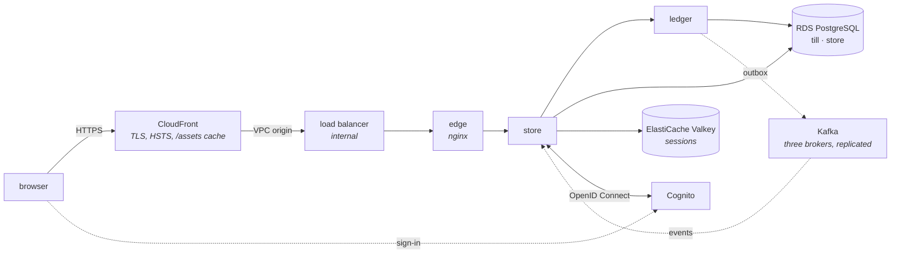

# till on AWS

The compose stack, on AWS, for as long as it is needed: Fargate for the four services, RDS for
PostgreSQL by default (or Aurora PostgreSQL Serverless v2 — [below](#the-database-rds-or-aurora)),
ElastiCache for the sessions, Cognito for Keycloak, and CloudFront in front. Terraform describes it;
`scripts/aws.sh` builds the images, starts it, checks it, and stops it again.

It is built to be **started for a session and stopped after it**. Running costs about $0.16 an hour;
stopped, it costs cents a month.



Everything in the middle runs in one VPC. The load balancer is internal: CloudFront reaches it
through a [VPC origin][vpc-origins], a network interface CloudFront places in the private subnets, so
there is no path from the internet to anything here that does not go through CloudFront.

## Using it

Needs the AWS CLI with a profile that can create all of this (`till-deploy` unless `AWS_PROFILE`
says otherwise), Terraform 1.10 or later, Docker and jq.

```sh
scripts/aws.sh bootstrap   # once: the state bucket and the image registries
scripts/aws.sh up          # build, push, start, check — about forty minutes
scripts/aws.sh accounts    # the demonstration accounts, to sign in with
scripts/aws.sh down        # stop the hourly bill — about fifteen minutes
scripts/aws.sh status      # what is billed by the hour and still there, and since when
```

`up` builds the images from the commit that is checked out, and refuses to run with uncommitted
changes: an image is named after its commit, and one built from a dirty tree would not be what its
name says. It pushes them, shows Terraform's plan, asks, applies exactly that plan, plans again to
make sure there is nothing left to change, and then runs the checks below.

Nearly all of the forty minutes is CloudFront, one step after another: the VPC origin takes about
fifteen to deploy, and the distribution that uses it about eighteen more. The database is ready in
five, and each service is steady in about two once the one before it is. `down` does the same in reverse and finishes with `status`, which asks AWS rather
than Terraform, so it finds anything a failed apply left behind. `destroy` removes everything,
including the bootstrap.

## The safety net

Every `up` sets a deadline three hours out (`auto_stop_hours`), and at it EventBridge Scheduler sets
every service's task count to zero — whether or not anybody is left to run `down`. The tasks are
nearly all of the hourly cost, so what remains until `down` is the load balancer, the database and
the cache, about $0.05 an hour instead of $0.16, or $0.50 set up for a load test. Another `up`
brings the tasks back and starts the clock again; `status` says when it will fire. The schedules
call ECS through a role that can do that and nothing else (`till-auto-stop`).

It exists because on 30 September a load test's deployment ran for seven and a half hours after its
last run: the session that would have taken it down was interrupted, and by the time it came back
the credentials that could have done so had expired. About four dollars of nothing; a deadline kept
inside AWS needs neither.

## What `up` checks

`scripts/aws.sh smoke` runs these against the deployment, and `up` runs it last:

| Check | Why it is a check |
| --- | --- |
| Plain HTTP is sent to HTTPS | CloudFront's viewer policy |
| A storefront route answers with the edge's CSP and CloudFront's HSTS | both layers are in the path |
| A game is in stock | stock is seeded through the ledger as the store starts, and availability is what the store's projection read from Kafka since — so this is the whole event path, ledger to outbox to broker to store |
| The catalogue is cached at the edge | `X-Cache-Status: HIT` on a repeat |
| Nothing of the ledger is reachable, even with a token | a path the storefront does not draw is the storefront |
| Signing in goes to Cognito, which accepts the callback | the store built an `https` redirect URI for this deployment's address, and Cognito's sign-in form — not its error page — answers it |
| The edge sees the viewer's address, not one the viewer claims | below |

The last one is there because the edge's rate limits key on the viewer's address, which it takes
from `CloudFront-Viewer-Address` for any connection from inside the VPC. That is safe only if
CloudFront replaces a `CloudFront-Viewer-Address` a viewer sends, and AWS's documentation does not
say that it does. So the check sends one, `203.0.113.7:4444`, and reads the edge's access log in
CloudWatch to see which address it recorded. On the first deployment it recorded the real one:
CloudFront does replace it — and the check goes on asking, because nothing promises it always will.

Signing in itself is done by a person, in a browser, with an account from `scripts/aws.sh accounts`.

## What it costs

On-demand prices in us-west-2, from the AWS Price List API:

| | Size | Per hour |
| --- | --- | ---: |
| Fargate, ARM: edge | 0.25 vCPU, 0.5 GB | $0.0099 |
| Fargate, ARM: store, ledger | 0.5 vCPU, 2 GB each | $0.0466 |
| Fargate, ARM: Kafka ×3 | 0.5 vCPU, 2 GB each | $0.0699 |
| Public IPv4, one per task | 6 (edge, store, ledger, Kafka ×3) | $0.0300 |
| Application Load Balancer | idle | $0.0225 |
| RDS for PostgreSQL | db.t4g.micro, single-AZ, 20 GB gp3 | $0.0192 |
| ElastiCache for Valkey | cache.t4g.micro, one node | $0.0128 |
| **Running** | | **$0.211** |

One Kafka broker at this size is $0.0233 an hour (0.5 × $0.03238/vCPU-hour + 2 × $0.00356/GB-hour);
three are the $0.0699 above — three times one, because nothing is shared between them
([ADR 13](design/0013-kafka-replication.md)). Round the total to $0.22 for what is metered rather
than reserved: CloudWatch Logs at $0.50 a GB written (a little more of it now, from two more
containers), load balancer capacity units at $0.008 each, DNS queries. CloudFront's always-free
allowance — 1 TB and 10 million requests a month — covers a session many times over, and so does
Cognito's 10,000 monthly users.

Stopped, what is left is ECR's storage ($0.10 a GB-month, for about a gigabyte of images), the logs'
($0.03 a GB-month, kept a week) and the state bucket's — cents a month in all. The VPC, its subnets,
security groups and internet gateway, the Cognito user pool, the Parameter Store parameters and the
IAM roles cost nothing at rest. Cloud Map's hosted zone is $0.50 a month but is deleted with every
stop, and a zone deleted within twelve hours of its creation is not billed.

## The database: RDS or Aurora

PostgreSQL is RDS or Aurora PostgreSQL Serverless v2, picked per deployment: `scripts/aws.sh up
--database=aurora` runs against Aurora, and plain `up` or `--database=rds` keeps the default. Either
way it is `till`'s one instance with the ledger's database and the store's, the same credentials, so
switching is a deployment choice (`infra/variables.tf`'s `database`), not a code change.

This account is on AWS's free plan, which caps each option on its own terms:

- **RDS** allows only `db.t3.micro` or `db.t4g.micro` — anything bigger is refused with
  `FreeTierRestrictionError`. $0.0192 an hour, in the table above, whether or not a connection is
  open.
- **Aurora PostgreSQL Serverless v2** allows at most 4 ACU and 1 GiB of storage per cluster. That is
  charged against the account's credits rather than free: about $0.12 an ACU-hour — up to $0.48 an
  hour at the 4 ACU ceiling — plus I/O on Aurora Standard storage. Unlike RDS, it can fall to nothing
  between connections: `min_capacity = 0` in [`infra/runtime/state.tf`](runtime/state.tf) pauses the
  instance entirely rather than floating at a minimum charge, and it resumes on the next connection
  in about fifteen seconds.

`scripts/aws.sh loadtest` records which one a run used, and, for Aurora, the
`ServerlessDatabaseCapacity` CloudWatch metric's maximum alongside the usual database CPU — the ACU
equivalent of the CPU figures above.

Every `up` of a running deployment keeps the database it has. An `up` that names another, or none
against one on Aurora, would replace the database with an empty one, so it stops and says so
instead: switching is `scripts/aws.sh down`, then `up` with the other.

## Set up for a load test

`scripts/aws.sh up --loadtest` runs it the way [`docs/load-test.md`](../docs/load-test.md) says a
load test runs: no CloudFront, so the load generator reaches the load balancer from inside the VPC
and the start takes fifteen minutes rather than forty; the store signing in against the stand-in
provider rather than Cognito; the edge's access log off; and the sizes in
[`loadtest.tfvars`](loadtest.tfvars) — two edges, four stores, two ledgers. The database stays a `db.t4g.micro`:
it is the largest a free-plan account may create, which refuses anything bigger with
`FreeTierRestrictionError`.
`scripts/aws.sh loadtest` then runs the load generator once and saves the result.

| | Size | Per hour |
| --- | --- | ---: |
| Fargate, ARM: edge ×2, store ×4, ledger ×2, Kafka ×3, the stand-in provider | 11.5 vCPU, 29 GB | $0.476 |
| Fargate, ARM: the load generator, while a run lasts | 8 vCPU, 16 GB | $0.316 |
| Public IPv4, one per task | 13 | $0.065 |
| Application Load Balancer, and its capacity units under 3,500 requests a second | about 27 | $0.24 |
| RDS for PostgreSQL | db.t4g.micro, single-AZ, and its unlimited-mode CPU beyond the baseline: $0.075 a vCPU-hour | up to $0.15 |
| ElastiCache for Valkey | cache.t4g.micro | $0.013 |
| **During a run** | | **about $1.26** |

One Kafka broker at the load test's size (1 vCPU, 4 GB) is $0.0466 an hour; three are $0.1399 —
about three times one, same arithmetic as the "Running" table above, folded into the $0.476 row
because that row was already one blended total before this change. Between runs — no load
generator task, but Kafka's three brokers still up — it is about $0.50 plus two more brokers'
$0.0932, so about $0.59 an hour. A session — start, a minute's trial, the protocol's run, stop —
is mostly at that between-runs rate and comes to well under a dollar still, the load generator's
share of it being minutes, not an hour.

## How it is split

| | Lives | Holds |
| --- | --- | --- |
| [`bootstrap/`](bootstrap/main.tf) | once per account, local state | the state bucket, the three image registries |
| [the root](.) | always, state in S3 | the network, the security groups, Cognito's user pool and its accounts, the secrets, the IAM roles, the log groups |
| [`runtime/`](runtime) | while `running = true` | CloudFront and its VPC origin, the load balancer, the Cognito app client, the database (RDS or Aurora), ElastiCache, Cloud Map, the ECS cluster and its services |

`runtime/` is a module the root instantiates with `count = var.running ? 1 : 0`, so stopping is an
apply rather than a second stack kept in step with the first. `running` defaults to false: an apply
that forgets to say is one that stops the bill rather than one that starts it.

What is kept across a stop is what would be tedious or pointless to recreate: the images, the
accounts and their passwords, the ledger's tokens. What goes is everything billed by the hour — and
the Cognito app client with it, because its callback URL is the CloudFront address, which is new
with every start.

## Decisions

**No NAT gateway.** The containers run in public subnets with public addresses, and their security
groups admit nothing from the internet; the addresses are for going out, to ECR, CloudWatch,
Parameter Store and Cognito. A NAT gateway is $0.045 an hour before it carries a byte — more than
all of the above but the containers — and VPC endpoints for the same four services would be $0.01
an hour each per zone. [`network.tf`](network.tf) says the same.

**Kafka is three brokers on Fargate, not MSK.** Three ECS services (`kafka-1`, `kafka-2`,
`kafka-3`), each its own KRaft node, replication factor 3 and `min.insync.replicas` 2 on every
topic — including the one the ledger declares — so losing any single broker loses neither an
acknowledged write nor the ability to take the next one. Each node's log is still on its own
task's disk, which Fargate does not keep across a replacement; that is accepted rather than
engineered around with persistent storage, and [ADR 13](design/0013-kafka-replication.md) says
why at length. The short version: the ledger's outbox is the durable record regardless of how many
brokers exist, a broker that restarts empty re-replicates from the two that did not, and this
deployment is a session that gets torn down, not a fixture that has to survive losing its zone.
MSK Serverless would be $0.75 an hour on its own, five times all of this; provisioned MSK is two
brokers at the least, $0.09 an hour for the smallest before storage, against $0.070 for three of
these (the arithmetic below).

**One zone for everything with state.** The database and the cache are single-instance, and
Kafka's three brokers all run in that same zone too — three brokers change how many copies of a
partition exist, not which zone holds them. All of it runs where the database and cache are rather
than paying for every query to cross zones. The load balancer is in two, because it has to be.

**CloudFront's own certificate.** There is no domain here, so the store is at
`https://d….cloudfront.net`, and CloudFront terminates TLS with the certificate that comes with it.
It reaches the load balancer over plain HTTP inside the VPC, and tells the edge the viewer's scheme
in `CloudFront-Forwarded-Proto`, from which the store builds an `https` sign-in redirect.

**Secrets in Parameter Store.** SecureString parameters are free and encrypted with the account's
AWS-managed key; Secrets Manager is $0.40 a secret a month and rotates, which nothing here needs.
ECS puts them in the containers' environment at start-up, so no task definition contains one.

**Generated passwords for the demonstration accounts.** The compose stack's Keycloak realm is
published in this repository, passwords included. The Cognito accounts have the same names and
generated passwords, and sign-up is closed.

## What a production deployment would change

- RDS Multi-AZ with backups, deletion protection and a final snapshot; the store with a database
  user of its own rather than the master user.
- MSK, or persistent, replicated storage under Kafka's three brokers (EFS; today's disks are
  ephemeral Fargate storage, re-replicated from the surviving two on a restart) — and more than
  one zone for the whole stateful tier, database and cache included, not only Kafka.
- The containers in private subnets behind NAT gateways or VPC endpoints, one per zone.
- A domain of its own: an ACM certificate on CloudFront and HTTPS from CloudFront to the load
  balancer; AWS WAF in front.
- Autoscaling on the store and the ledger, alarms on the ledger's p99 and its outbox lag
  ([`docs/operations.md`](../docs/operations.md) says which), and the images built and pushed by CI
  through OIDC rather than from a laptop.

[vpc-origins]: https://docs.aws.amazon.com/AmazonCloudFront/latest/DeveloperGuide/private-content-vpc-origins.html
